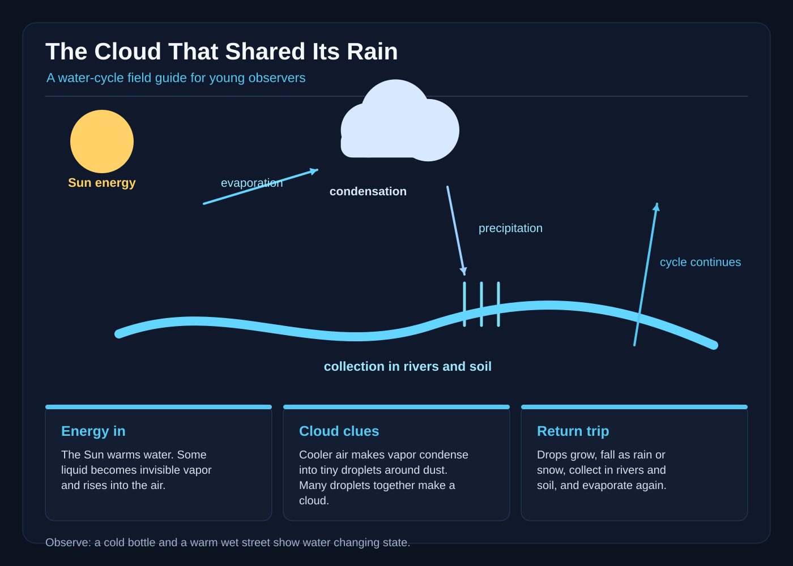

# The Cloud That Shared Its Rain

Mina woke to a silver blanket of cloud stretched over Bellwether Village. The cloud covered the hill, the bakery roof, and the little blue pond. It did not have a face or paws, and it never waved back. Still, when a pale patch of morning slipped beneath it, Mina said, “I think that cloud is taking a walk.”

Her grandmother handed her a bright red umbrella and a small field notebook. “Follow its shadow if you like,” she said. “But remember: a cloud is a busy crowd of tiny water drops and ice crystals, not a creature.”

Mina left the village gate and followed the cloud’s cool shadow along the river road. The cloud moved whenever the wind moved, and the wind came from the warm fields beyond the hill. Mina could not see the wind, but she felt it tug her red scarf and lift the grass in little waves. The cloud traveled with that moving air, high above the road, as if it were a boat with no mast. Every so often, a drop of water slipped from its bottom, vanished into the air, and was gone.

At the first bridge, Mina saw the river shining below. “Where did all this water come from?” she asked. Grandma had told her that the Sun had warmed the river, the puddles, and wet soil. The Sun’s warmth gave some water enough energy to change from liquid into an invisible gas called water vapor. This is evaporation. The water was still there, but it had become too tiny and mixed with the air to see.

Mina opened her notebook and drew a little sun beside three wiggly lines rising from the river. Then she looked up at the cloud. “Are you made of invisible water?” she asked. She laughed when the cloud drifted past without answering. Yet she could imagine all those invisible threads joining together high in the cooler air. As the vapor cooled, it changed back into tiny drops. This is condensation. The drops crowded together around specks of dust, and millions of them together made the shining gray-white shape overhead.

At the hill, Mina watched a butterfly flutter beneath the cloud’s shadow. The butterfly did not follow the cloud, and the cloud did not follow the butterfly. They were simply sharing the same patch of sunlight for a moment. Mina rested her hand on a warm stone. The stone had been heated by the Sun, and a tiny damp patch beside it began to shrink. She imagined the water leaving as invisible vapor, joining the air, and climbing toward the cooler sky. “Up you go,” she whispered. The cloud cast a broad gray shadow over the road, then bright sunlight broke through a hole in it. For a moment the vapor was hard to picture, but Mina trusted the warm stone, the river, and the drops she had seen.

The wind carried the cloud over a farm where the fields had gone brown. Mina’s shoes squished in the mud. Farmers looked up, too. The cloud was not sharing its rain on purpose; it simply traveled above them as the air and water took their long, invisible path. Still, its rain could fall where the village needed it.

A single drop landed on Mina’s nose. Then another. Soon the cloud released a gentle shower. Drops fell from the cloud and landed on leaves, rooftops, and the cracked earth. This is precipitation: water returning from the sky as rain. Mina opened her umbrella, but she also held one hand out to feel the drops. They were cool and clean, carrying tiny bits of the sky down to the ground.

Soon the brown fields drank in the rain. The children of Bellwether ran to the garden with buckets. Mina helped an old farmer scoop water from a low gutter into a wooden cart. The water gathered in the gutter, ran along the ground, and soaked into the soil. Some of it moved underground toward springs, and some joined the stream that led back to the river. This is collection. Water collects in oceans, lakes, rivers, puddles, and underground spaces, ready to travel again.

When Mina returned home, the sun shone through a gap in the clouds. The wet street began to shine. She saw a shallow puddle by the gate and wondered where its water would go next. Some of it would soak into the ground. Some would flow to the river. And when the Sun warmed it, some would rise again as water vapor. The cloud had not been an animal giving away a present. It was part of a changing cycle, connected to the river, the soil, the plants, the animals, and the Sun.

Before bed, Mina opened her field notes. She drew the sun, the rising vapor, the puffy cloud, falling rain, and the stream. Under the pictures she wrote, “The cloud shared its rain because the water carried it here. The Sun helps water rise. The wind carries it. Then the water falls, gathers, and rises again.”

The next morning, the cloud was gone. A clean, blue sky hung over the village. Mina looked at the shining gutter and smiled. Water was already on its way around the circle again.
