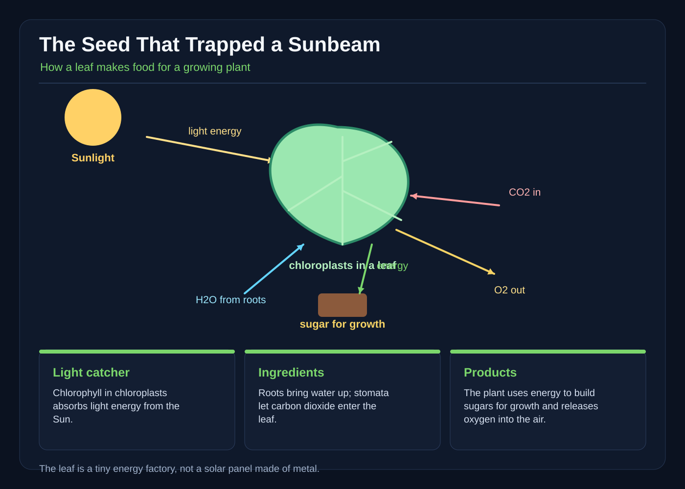

# The Seed That Trapped a Sunbeam

The first thing Nia saw was a sunbeam with no place to go.

It shone through the round window of the school greenhouse and landed on a young leaf inside a clay pot. The light made the leaf glow emerald, but it did not continue across the floor. It seemed to vanish there, swallowed by green.

“A seed has trapped it!” said Nia.

Her friend Jo laughed. “Seeds don’t have pockets for sunlight.”

Nia put one hand against the glass. “This one does.”

Their science teacher, Ms. Fen, looked up from watering the pepper plants. “Then let’s find out what it is doing.”

The three of them went to the leaf. It belonged to a bean plant no taller than Nia’s boot. One white petal had fallen beside the pot. Nia bent close. Thousands of tiny openings dotted the leaf, too small for her to see clearly.

“Look at the roots,” Ms. Fen said.

Nia slipped the pot’s top layer of soil aside with a small spoon. White roots branched through the dark soil. “They look like strings.”

“They do more than hold the plant up,” Ms. Fen said. “Roots take in water from the soil. The stem carries that water to the leaves.”

Nia imagined the roots drinking while the leaf drank light. The picture seemed wonderful, but it did not yet prove anything.

Ms. Fen gave each of them a paper hat. “For three mornings, put a hat over part of a new leaf. Leave another part uncovered. Keep watering the plants the same way. Then we will see what changes.”

Nia’s seed had only one small new leaf, so she divided its future in two. She placed a paper hat over the half nearest the window and left the outer half bare. Jo did the same to a bean plant on the shelf.

For three days, Nia hurried to the greenhouse before morning reading. She touched the soil, counted the paper hats, and watched the bare half shine.

On the fourth morning, Ms. Fen removed the hats. The covered part of Nia’s leaf was pale, while the uncovered part was deeper green. Jo saw the same difference. The color had changed little by little, but the plants were giving them a clue.

Ms. Fen opened a leaf from a plant that had grown in bright light. Inside tiny cells she showed them flecks of green. “These are chloroplasts. They contain chlorophyll, the green substance that absorbs light energy.”

“Light energy?” Nia asked.

“It is energy carried by light. Chlorophyll takes that energy and helps the leaf use water and carbon dioxide to make sugar.”

Jo pointed through the window. “Where does the carbon dioxide come from?”

“People and other living things make carbon dioxide when they breathe. Plants take it from the air.”

Nia looked at the tiny openings Ms. Fen had pointed out earlier. “Through the little doors in the leaf?”

“Those openings are called stomata. Carbon dioxide can enter through them. Water comes up from the roots. The leaf uses the light energy to help make sugar from those ingredients.”

For a moment, Nia’s strange idea returned. A sunbeam was not truly trapped inside the leaf. The leaf captured its energy, just as a bright-colored kite catches moving air.

“Sugar isn’t only food for people,” Ms. Fen continued. “The plant uses some of it to build new cells and grow. It may store some for later.”

“And oxygen?” Nia asked.

“Oxygen is released from the leaves. Plants also take in carbon dioxide and release oxygen during photosynthesis.”

Nia wrote the new word carefully. P-H-O-T-O-S-Y-N-T-H-E-S-I-S. It did not look like magic. It looked like a busy recipe with sunlight as its fuel.

That afternoon, the children set an upside-down funnel over a green pondweed sprig in a bowl of pond water. They covered it underwater with a glass jar so no air was trapped inside. A similar sprig sat in a dark box. Ms. Fen left the first where light could reach.

The next morning, tiny bubbles clung to the lit pondweed and rose into the water. The dark jar had few or none. Ms. Fen explained that the bubbles from the plant in light contained oxygen. In darkness, the pondweed was not making sugar by photosynthesis.

Nia hurried back to her bean plant. The “trapped sunbeam” was brighter now, but the beam itself still moved as the sun moved. One leaf could not hold light for the whole day. Instead, it was using light energy every moment it had enough to work.

Nia opened her field notebook. She drew the roots, stem, and leaf, with its invisible stomata. Beside the chloroplasts she drew tiny green suns. Then she added arrows for water, carbon dioxide, sugar, and oxygen. The arrows did not make a perfect circle, because plants also use stored sugars. But they helped her see the process.

* * *

For a week, Nia visited the bean before classes. She watered the soil, turned the pot a quarter turn, and moved it from the greenhouse’s deepest corner. Morning light fell across the leaf. A breeze through an open vent brought fresh air.

The pale part of the experimental leaf stayed pale. The uncovered part remained green. Then, along the stem, a tightly curled new leaf began to open. It was no bigger than Nia’s thumbnail at first. Day by day it flattened, showing a second green blade.

“It didn’t trap a whole sunbeam,” Nia told Jo. “It caught light energy. It had water from the roots and carbon dioxide from the air. The leaf made sugar for growing, and oxygen went back outside.”

Jo looked toward the schoolyard, where children were running and breathing. “So that beam helps feed the plant while the plant helps change the air.”

Nia nodded. “Not all at once, and not without water. But yes.”

When the second leaf unfolded, the bean stood in a triangle of sunlight. The greenhouse glass gleamed around it, but no mystery hid in the shine. The wonder was real: roots drinking, tiny doors opening, green packets receiving energy, and a plant building itself from sunlight.

Nia closed her notebook. The sunbeam had not vanished. It had done its work.
