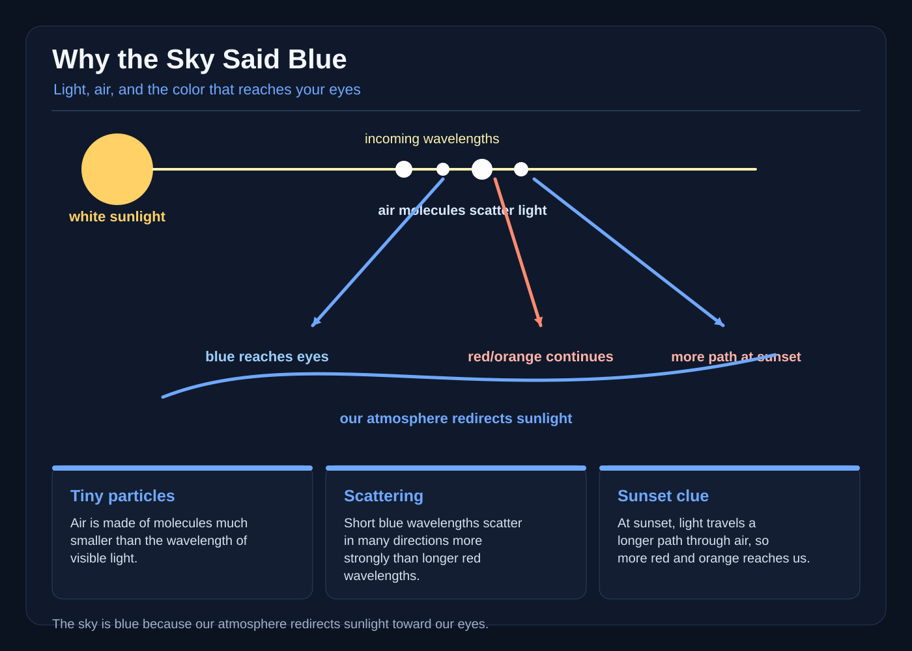

# Why the Sky Said Blue

Pella was nine, and every morning the hill sky said the same word to her: blue.

Not out loud. The Prism Bell on top of the tower said it for her: a globe of clear glass with no clapper that rang in a color when sunlight struck it. Ringing blue, it wrote BLUE in the frost-light on the wall.

"Every bell needs a color inside it," said Bell-Master Odris. "The old keepers gave it a blue stone dredged up from the deep sea. You must give it a new one before the equinox."

Pella looked at the empty hooks inside the glass. "A blue stone?"

"A blue stone. Or a feather. Or a drop of blue glass. Any blue thing holds."

Pella frowned. The only blue thing in the tower was her own shirt, and she did not think her shirt counted.

* * *

She asked Maro, who ran the bait shop and knew more about the sky than anyone alive.

"The sky is blue because it's a mirror," Maro said. "A great round mirror hanging over us. It reflects the sea. That is where the blue comes from."

Pella wanted this to be true more than anything.

* * *

So she went to check.

She carried the bell's brass spyglass to the roof and looked in every direction.

Over the river, blue. Over the green barley, blue. Over the goats' hill, blue. Over the barn, painted a loud, angry red, blue.

"There is no sea near that barn," she said.

At noon she lay in the grass and looked straight up. Overhead the sky was the deepest blue she had ever seen. Toward the horizon it faded pale and milky, because light there has bounced so many times among air molecules and dust that all the wavelengths mix into a near-white glow. A mirror would show her something different in each direction. This one did not. It reflected no sea, barn, goats, or river. Instead, it made a continuous dome that did not care what lay underneath.

That night there was no sun. Pella climbed the tower in the dark: the bell was only gray glass, and the sky above the town was black.

"So the blue needs the sun," she said. "But the sun is not blue. The sun is white."

* * *

In the cellar she found an old lantern, a glass pitcher, and a bottle of milk. She carried them up to the bell chamber and shut the curtains.

She filled the pitcher with water and stirred in three spoons of milk until it turned cloudy.

"A cloud," she whispered. "A whole tiny cloud in a pitcher."

She shone the lantern through the cloudy water. Straight ahead the beam was hard to see. She moved to the side and looked across the room.

The beam was pale blue.

She moved back in front of the lantern. No blue. To the side again, glowing soft blue all along.

Pella wrote in her sky-book. *From the side the beam is blue. Straight down the beam it is white.*

Then she held red window-film over the lantern and did it all again.

The beam glowed red. She tried green. The beam glowed green.

Pella sat back on her heels. "The beam isn't colored by the water," she said. "It takes the color of whatever I put over the lantern. The cloudy water only does one job: it throws light every which way. What goes in comes out the side."

* * *

Odris's shelf of old rules said, in the first book: *Air is empty. Air cannot do anything.*

Pella read it twice. Then she wrote underneath: *Air is not empty. It is a million tiny molecules, always throwing light about — but not equally. Short, jumpy blue waves get knocked around far more than long red waves. Red light mostly goes straight through; blue gets thrown every which way, so it comes from all over the sky at once. The scientists call this Rayleigh scattering. My cloudy pitcher is only a pretend sky, but it does the same job.*

* * *

The equinox came. Pella climbed to the bell chamber with nothing in her hands.

"What have you brought?" asked Odris.

"Nothing."

He looked at the hooks. "The bell needs a color, girl, or it will stay silent."

"Then give it the sun," said Pella.

Odris stared at her. Then he opened the shutters.

Morning sunlight poured into the chamber, and Pella set the glass to take it straight in. Sunlight has no color of its own. It is white, and white is every color at once.

The bell woke with a hum low enough to feel in the teeth.

The frost-light wrote its word, and it was not the word Pella had come to fix.

BLUE.

Down in the town, someone cheered. The sky was blue, as it had been every day of Pella's life, and now the town knew why: the bell held no blue stone. It held white light, and the air above threw the blue part of it everywhere at once.

* * *

The next evening she carried the bell up to the ridge to watch the sun go down.

At noon sunlight comes almost straight down. At sunset it slants, crossing a very long way to reach the ground — many more miles of air than it crossed at noon.

Pella watched the sun touch the horizon. The long white beam slid into the bell, and what came out the far side was not white.

It was gold. Then orange. Then a deep, glowing red.

"The blue is gone," Pella said.

Not really gone. She turned and looked back the other way. High above the earth the sky was still blue. The blue had not vanished — it had been thrown sideways out of the beam, so the light that reached her face was only what was left. That was the direct beam, the one that had lost its short blue waves. The pale band above the horizon was different: glow scattered and reflected many times, every wavelength mixed, so it stayed whitish.

At sunset the direct beam crosses far more air, so it gives up far more of its short blue waves and arrives red.

* * *

The bell wrote RED while the sky straight overhead still wrote BLUE. Two words, one bell, one beam of white light, two lengths of road.

Pella's field notes filled six pages that autumn.

*Sky, noon, over a red barn: blue. No blue object near. No sun at night, no blue. The sky is not borrowing a color.*

*The horizon is pale because that light has bounced among air and dust until every color mixes into a glow. The sunset beam is different: it lost its short blue waves.*

*The sky is not blue. The air is blue-making. The sun is white. Clouds are white because their drops are too big to favor one color, so they throw all of it at once.*

* * *

By the next equinox Pella was Bell-Master. She gave the bell no stone at all, only a shutter that opened at sunrise and closed at dusk.

Every year since the sky has said its word. At noon it says blue. At the edge of the day it says red and gold, and the old bell rings the change.

And whenever a new apprentice asks where the blue comes from, Pella stirs three spoons of milk into a pitcher of water and shows them that the sky's blue was never anybody's blue at all.

It is the sun's white light, turned by all that clear air.
