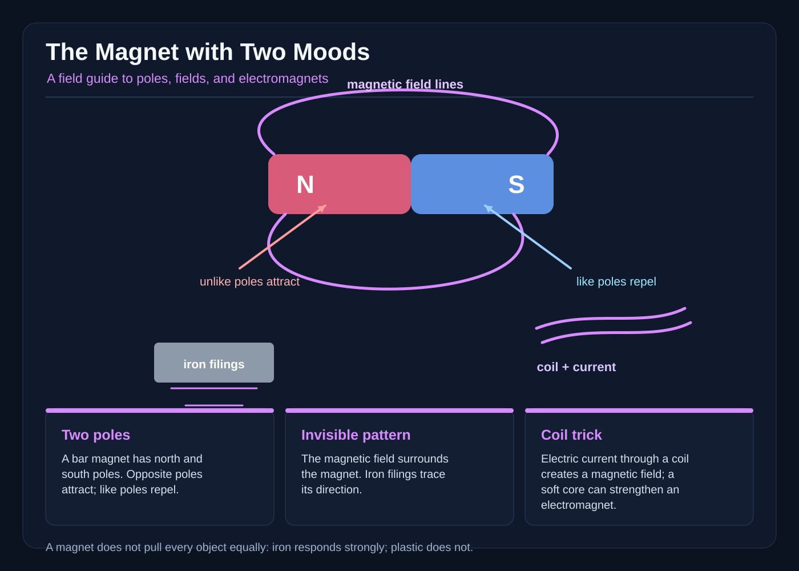

# The Magnet with Two Moods

On the morning the school fair was cancelled, Niko found a bar magnet under the hedge.

It was painted red on one half and blue on the other. The red half pointed toward the tool shed, and every loose paper clip in Niko’s pocket marched toward it. The blue half pointed toward a brass doorstop, which stayed still.

Niko held the magnet still. The clips pressed against the red end. Then he turned the magnet around. The clips let go and raced to the other end.

“Two moods!” he said.

His sister Luma watched from the garden gate. “Maybe it likes red and dislikes blue.”

“That is a guess,” Niko said. He was used to writing down guesses before he tested them. His science notebook had a page titled MAGNET MYSTERIES. The first line said: A magnet may have rules, but we do not know them yet.

They made a test tray from a cereal box. Niko placed a steel paper clip, a copper coin, a brass doorstop, a wooden spoon, a glass marble, a plastic button, and a second bar magnet on the tray. Luma drew two columns on the ground with chalk: MOVED and DID NOT MOVE.

Niko brought the red end close to each object, one at a time. He kept the same distance and moved slowly.

The paper clip jumped toward the magnet.

The copper coin stayed still.

The brass doorstop stayed still.

The wooden spoon stayed still.

The glass marble stayed still.

The plastic button stayed still.

The second magnet moved away.

Niko recorded each result. He did not write “the magnet dislikes copper” or “wood is too shy.” Those sentences claimed reasons they had not tested. He wrote: “Red end pulled the paper clip toward it. Copper, brass, wood, glass, and plastic did not move in this test.”

“What about the other magnet?” Luma asked.

Niko placed the first magnet on the tray with its red end facing forward. He placed the second magnet beside it, with its red end also facing forward. The second magnet slid backward.

He turned the second magnet around, so blue faced forward. The two magnets moved together and clicked.

Luma frowned. “So red is the strong mood?”

Niko held up his notebook. “We know what happened, not why. Let’s keep the words honest.”

Dr. Moss brought iron filings, a battery, wire, a spool of insulated copper wire, and an iron nail to a tiny fair booth.

“First, we check whether the second magnet is special,” she said. “A bar magnet has two ends called poles. We call them north and south, even when the magnet is not near a compass. When the north pole of one magnet faces the north pole of another, those like poles repel. When north faces south, unlike poles attract.”

Niko pointed to the red and blue paint. “So red can be north and blue can be south, or the other way around.”

“Exactly. The colors are labels people added. The behavior comes from the magnet.”

Dr. Moss sprinkled iron filings over a sheet of paper. She placed the bar magnet beneath it and tapped the paper gently. The tiny black pieces jumped and settled in curved rows.

“Do the lines you see really travel from one pole to the other?” Niko asked.

“They show the pattern of the magnetic field,” Dr. Moss said. “A magnetic field is the region around a magnet where its force can act. The filings make a visible hint of that pattern. The curved lines are a useful model, not glowing wires floating in the air. We draw them as if they curve from one pole to the other, and they become farther apart as the magnet’s effect weakens.”

Niko tried the experiment again. He moved one pole close to the filings. The filings packed tightly. He moved it farther away. The pattern spread out. “Close things respond more strongly than far things,” he said.

“For this paper clip and this magnet, yes,” Dr. Moss answered. “Distance matters, but how strongly an object responds also depends on its material and shape.”

She handed Niko a small compass. When he carried the bar magnet around the compass, the needle swung. The needle did not point toward every part of the magnet equally. It responded to the field around the ends. Niko wrote: “The compass needle moved when the magnet was near. The magnet’s ends had the strongest effect.”

Niko tapped the magnet’s red end against the metal gate. It stuck. He tapped the blue end. It stuck too. He tried a plastic chair and a paper cup; neither moved.

“The gate responds to a magnetic field,” he said. “The chair and cup did not respond in this trial.”

“Inside magnetic materials are tiny regions called domains,” Dr. Moss added. “Their magnetic effects can mostly cancel when they point different ways. A field can line up many domains, so the material becomes attracted to the magnet.”

Niko’s pencil scratched across the page. He wrote a new paragraph:

OBSERVED: A magnet pulled a steel paper clip and a metal gate toward it. Two magnets moved apart when the red ends faced each other and together when opposite ends faced. Copper, brass, wood, glass, and plastic did not move in the trials.

GUESSES TO TEST: Maybe the paper clip is close to the pole, or maybe its shape helps it turn toward the magnet. Maybe the second magnet feels a push because its ends are alike.

NOT YET PROVEN: The magnet has feelings. It likes red. It chooses a favorite object. A magical compass tells wishes.

Luma read the last line and nodded. “That is fair. We can imagine a story about a moody magnet, but we should not pretend the imagination is evidence.”

Dr. Moss smiled. “Science stories can have magic in them. A dragon can carry a library as long as the story tells us it is fantasy. But when a story claims to explain what really happens, we need tests.”

* * *

For the demonstration, Dr. Moss showed them an electromagnet. She wrapped insulated copper wire around an iron nail. The loops were a coil, a tidy spiral that carried electric current when the circuit was complete. She attached the wire ends to a battery through a small switch.

With the switch open, she placed a paper clip near the nail. It stayed on the table.

She closed the switch. Electric current flowed through the coil. The nail became a temporary magnet, and the paper clip leaped to it.

“Did the battery make a permanent magnet?” Niko asked.

“Not this one,” Dr. Moss said. “The coil and the current create a magnetic field around the nail. When the current stops, this electromagnet loses most of its effect. The coil can be shaped into a ring, and many turns of wire make the field stronger. A magnetic core can help guide the field too.”

She opened the switch. The paper clip dropped.

Niko tried the experiment with fewer loops. The clip moved, but only when it came very close. With the larger coil, it moved from farther away. He recorded the distance with a ruler and repeated each trial twice.

Niko wrote: “More turns in this coil made the electromagnet respond at a greater distance. When the current stopped, the nail no longer held the clip in this setup.”
The children placed the two magnets on the tray. With the red poles facing, they slid apart. They turned one around, and the magnets clicked together. Niko switched off the electromagnet; the clip fell into its box. “Observed, not guessed,” he said.

Luma pointed to the wooden spoon. “It did not move.”

“That tells us the wooden spoon did not move in this test,” Niko said. “It does not prove every object responds in the same way.” He opened the notebook to a fresh page and wrote: “The mystery got smaller when we tested it.”

“Here is what we can say with evidence,” she said. “A bar magnet has two poles. Like poles repel; unlike poles attract. Its field is strongest near the poles, and iron filings reveal a curved pattern. Domains inside magnetic materials can line up in response to a field. An electromagnet uses a coil and electric current to make a temporary magnetic field.”

“And if it seems to have two moods?” Luma asked.

“Then we describe the two ends,” Niko said. “We do not give it a heart just because it surprises us.”

He closed his notebook. The red and blue ends rested side by side, quiet and unchanged. The mystery had not vanished. It had simply stopped pretending to be magic.
