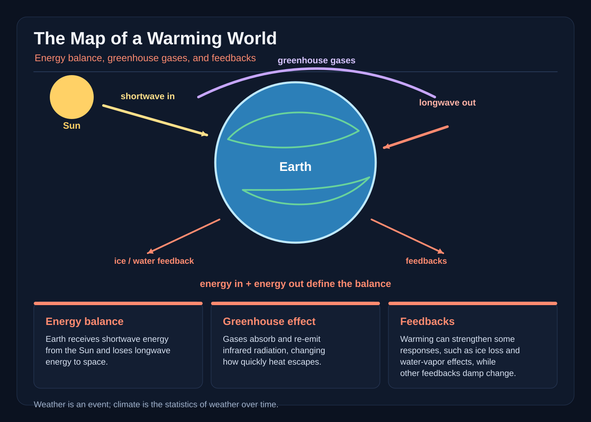

# The Map of a Warming World

On the first day of the Thawmoot, sixteen-year-old Ilyra Venn found a summer locked inside the north sea.

The map room occupied the highest tower of the Archive of Coasts. Its walls curved away from the winter light, and its tables floated a finger’s width above the stone so that nothing could be pinned to them. Beyond the eastern windows, the harbor was white with snow. On Ilyra’s table, a blue summer shone beneath glass.

“Correction accepted,” said Master Orren.

He did not touch the map. The line Ilyra had drawn along the harbor ice had thickened, uncurled, and pushed a little sailboat from winter into a green August channel.

“A map is not a picture,” Orren told the class. “Once its correction is witnessed, the land remembers the corrected version.”

Four apprentices stared at the stolen summer.

“Then why are some maps wrong for months?” Ilyra asked.

“Because maps are instruments of choices.” Orren tapped the margin where the original ice date remained. “And choices are rarely unanimous.”

Ilyra cared more about the margins than the blue water. That morning the observatory had delivered a report from the western ridge: snow fell in August for the first time in the ridgekeepers’ records. At the same time, the harbor seals had vanished early, and the lower orchard had flowered twice. The report could be damaged, the orchard could be enchanted, and a rare season could resemble another. But the map room’s oldest instrument, the Broad Balance, had drawn a thin red line of heat through all three places.

Now the Thawmoot Council had given Sera an order about that line, to be carried out before the Spring Market. Foreign merchants were expected. The city’s winter charter, its guides, and its entire treasury depended on snow.

“Leave the red line,” Ilyra said.

“No,” said Councilwoman Sera.

She entered without stamping snow from her boots. Sera governed not by crown but by signature. When she signed a fact into the Registry, roads, wards, and weather marks obeyed it within the city boundary.

The red line dimmed as she studied it.

“Remove every warm-year mark from the public charts,” she said. “Keep the measurements. Conceal the pattern.”

“Which part is the pattern?” Ilyra asked.

“The part that frightens them.”

* * *

Ilyra copied the red line before the erasure ink dried. She copied it as a crooked blue road, because a familiar color disguised it. Then she stole a moon-glass thermometer, a rain gauge, three years of harbor tide ledgers, and the Broad Balance’s oldest calibration rings.

Master Orren stopped her at the stair.

“You are breaking the archive oath.”

“I’m extending the survey.”

“To where?”

Ilyra looked at the map still glowing on the tower table. The stolen summer had deepened, and a red stitch had begun to trace the coast.

“To the places the map refuses to show.”

Orren placed the archive key in her hand. It was warm from the table and shaped like an open book.

“Keep your instruments paired,” he said. “A number alone is confident noise. Compare it with air, water, ice, witnesses, and other numbers. Record what the instruments cannot know.”

* * *

The road north climbed into the weather that followed her. By noon, snowflakes the size of coins struck the windows of the mail coach. By evening, the same streams ran brown with meltwater. Drivers usually said such a day was impossible. Ilyra wrote: “Snow at noon. Rain at evening. Both may occur in a year whose ordinary state is shifting.”

The keeper’s old balance opened at midnight. Its brass dish pointed toward the sky, collecting a silver line of moonlight. A second needle swung toward the ground. When balanced, the instrument held steady. When the silver line strengthened, the ground needle dipped, as if a blank page were carrying more ink than it could.

“It measures energy, not temperature,” said a mountain keeper who had been waiting beside the road. “A layer can be warm and reflect strongly, or cool and hold heat for hours. The needle does not tell you which.”

Ilyra turned the calibration ring. The lower needle rose half a mark. Uncertainty did not vanish. It had a width.

Below them, a stream struck a rockslide and filled the pasture. The keeper shouted for help. Ilyra watched the water climb a survey post, then watched it fall half a finger when the blockage broke. She marked the high value but did not record the falling water as the water’s level.

“Yesterday there was no snow,” a farmer said. “Now look at it.”

“Look at the gauge too,” Ilyra replied. “The ground beneath this snow was warmer than the ground beneath the harbor ice.”

The farmer stared at her.

“One storm,” he said, “cannot prove the world is changing.”

“No,” Ilyra said, surprising herself by how quickly the answer came. “Nor can one mild winter prove it isn’t. Weather is the state of the atmosphere now: a storm, a dry week, a cold night. Climate is the statistics of weather over many years, including averages, extremes, and the length of seasons. One event can fit a pattern. One event cannot establish the pattern by itself.”

“And yesterday’s flood?”

“Yesterday’s flood is evidence worth measuring. Not a verdict.”

The farmer nodded slowly. He showed her two old channels dug by his grandfather and one modern culvert choked with gravel. “We can build for water that has not arrived yet.”

“Or pretend only old water counts.”

* * *

At the White Ear observatory, the senior astronomer, Dr. Sava, had kept a sun-glass chamber beneath the western dome. Its lenses focused sunlight onto a dark plate. Once each noon, apprentices measured the plate’s heat and compared it with records kept across the city.

“The sun is not burning like a coal,” Sava told Ilyra. “It releases energy. The energy arrives as light. Much passes through the atmosphere. Clouds, particles, and the air absorb some. Land and ocean warm until the energy they gain is returned toward space.”

He placed two brass dials in her palm. One was marked IN. The other was marked OUT.

“This is radiative balance,” he said. “Over time, the energy entering the system and the energy leaving it are close. Change one, and the temperature of the Earth system must respond until the balance is restored or altered again.”

The in-dial glowed.

“Where does the extra heat go?”

“Mostly into the ocean, then the land, ice, and living things. Eventually, energy returns to space as infrared radiation. The journey need not be quick.”

At the observatory’s instruments, Ilyra understood why her magic balance was simplified. The atmosphere did not stop sunlight like a roof. Greenhouse gases—chiefly water vapor, carbon dioxide, methane, and nitrous oxide—absorb and emit infrared energy, slowing the loss of heat to space. They do not create energy. They change how quickly it escapes. Clouds, airborne particles, water, land, and ice all affect the exchange, so a clear-sky reading and a cloudy-sky reading are not directly interchangeable.

“Add more carbon dioxide and the same sunlight still enters,” Ilyra said. “But the system has more difficulty losing added heat.”

Sava’s expression sharpened. “In the long run, yes. Responses unfold across years, and the change is not even everywhere. The ocean can absorb most of the excess, while land regions may warm faster. The Arctic is warming much faster than the global average. A coast, a mountain, and a farm can have different seasons and risks.”

The morning instrument showed the incoming solar energy within its expected range. They did not pretend that one clear noon described the whole planet.

Ilyra drew the red trend line again, but this time with a pale border. Inside the border, the old and corrected years overlapped. Outside it, the line was dotted.

“We don’t erase the measurements,” she said. “We show how sure we are and where we are not.”

* * *

On the seventh day, the White Ear received a message written in glowing ash.

The southern harbor had vanished beneath a night of rain.

Ilyra and Orren reached the quay in the gray morning. Rain stood ankle-deep in streets where carts had rolled the day before. The harbor sea wall had cracked. Fishing nets tangled in garden gates. People shouted that the deluge had destroyed every climate record, that someone had altered the stars, that the old winters were returning in a monstrous disguise.

Ilyra climbed the signal tower. A storm eye rotated over the sea, a vast wheel of cloud with a calm center. She held the rain gauge high. Its catch had already exceeded the line she had marked for the storm.

“Too much,” someone called.

The glass thermometer was not the highest reading on the quay. The harbor water was warmer than expected, and the air above it held astonishing moisture. Ilyra remembered Dr. Sava’s cloud chamber: warm air can hold more water vapor than cool air. When that moisture rises and cools, water condenses and falls. A warmer atmosphere can therefore load storms with more precipitation, though the result depends on the whole storm and many regions may see no increase.

She drew a broad question mark over the western clouds.

“Can you say this storm was made by warming?” she asked the circle of watchers.

No one answered.

“I can say warmer air and ocean supplied it with more water. I can say heavy rain becomes more likely in some conditions as the climate warms. I cannot say one harbor, one night, one storm proves the whole long trend. It does not disprove it either. We compare its pressure, moisture, path, season, and history with other storms and with decades of records.”

A fishing woman threw down a soaked ledger. Her father had kept it for fifty-three years. Every page was blurred, but the dates remained.

“Use it anyway,” Ilyra said.

They passed the afternoon sorting marks: date, tide, rain, damaged land, and what witnesses remembered. Some years were missing. The first rain gauge had been installed only twenty years before. The ledger was biased toward storms that destroyed nets, while ordinary seasons went unrecorded. A crooked post had made early tide figures too low. Every old measurement had a shape, a blind spot, and a margin of uncertainty.

Yet the longer record showed more warm seasons, earlier spring melt, fewer years with dependable winter ice, and heavier downpours concentrated in some seasons. The pattern was not every year. It was not every place. The evidence was not certainty without doubt. It was many imperfect signals agreeing often enough to demand caution.

At sunset, the ash message on the quay wall changed.

A new storm had been drawn above the city.

* * *

Sera found Ilyra in the map room with eight regional reports spread between the spring charts. Council seals marked the harbor, three farms, two schools, the lower orchards, and the mountain pass. The Broad Balance trembled between them.

“You have made a prognosis,” Sera said.

“I have made a map of choices.”

“Every map here is prophecy.”

“No. A chart can be wrong. A forecast has uncertainty. A plan can fail. We write those limits down.”

Sera placed her signing hand on the empty margin. “The merchants arrive tomorrow. The city needs winter.”

“The city needs homes that do not flood and patients that do not faint in overheated wards. A true map can show both.”

Sera looked older than she had that morning. “If I sign the warming line, people will take up the High Passes, close the harbor, and abandon orchards that may recover.”

“Not necessarily. The line has ranges, regions, times. Adaptation is not surrender. Nor does adaptation remove the need to reduce the greenhouse gases driving the long-term change.”

“What do you offer instead?”

Ilyra drew a new key. One branch led from reduced fossil-fuel use. The stones of the market still burned coal, the furnaces still fed stores, and the distant engines still pulled the trains. She knew changing lamps or closing one orchard would not repair the imbalance. The map did. It thinned the red glow when furnaces were repaired, riders shared carriages, and the council began replacing coal with wind, sun, and stored power. Not instantly. Not everywhere. The glow remained, because heat already stored in the ocean would not vanish with a decree.

A second branch led to public cooling halls, shaded courtyards, stronger roofs, early warnings, restored wetlands, and water-saving farms. A third led to careful relocation where risk was highest, planned with the people who lived there rather than erased by one distant signature.

Sera’s hand remained above the page.

“You’re asking me to accept a map that does not promise victory,” Ilyra said.

“I’m asking you what certainty is worth.”

“Less than another erased winter.”

The councilwoman pressed her signet into the margin.

The Broad Balance chimed. Across the city, shutters opened onto public halls. Cool water moved through new channels into the lower farms. The old harbor wall did not rise, and the distant coal fires did not vanish. The red line remained visible. But its color became layered: black for measured past, copper for the range of projected near futures, and blank white where the map could not yet see clearly.

* * *

The storm reached the harbor nine days later.

It was powerful, but weaker than the second ash drawing had suggested. Rain hammered the market and narrowed the streets. One newly strengthened school roof held. A wetland outside the old wall took the overflow. The revised drainage channel carried away silt that would have choked the inner basin. At the lower farms, water gauges rose without reaching the emergency mark.

Ilyra watched the Broad Balance in the tower. Its lower needle moved, then steadied before midnight.

The map had not made the storm vanish. The storm had not erased the climate. A preparation could change harm without changing the larger pressure all at once, just as a bandage eases injury without closing every wound.

At dawn, the eastern horizon burned gold. Ice remained in the northern channels, though less than the oldest blue line showed. Sava’s instruments continued measuring. The orchards began leafing after a late frost. The harbor seals returned, sniffing among the broken nets.

Orren entered carrying a blank public chart.

“What shall we erase?” he asked.

Ilyra drew the uncertainty border again.

“This time,” she said, “we erase nothing.”
