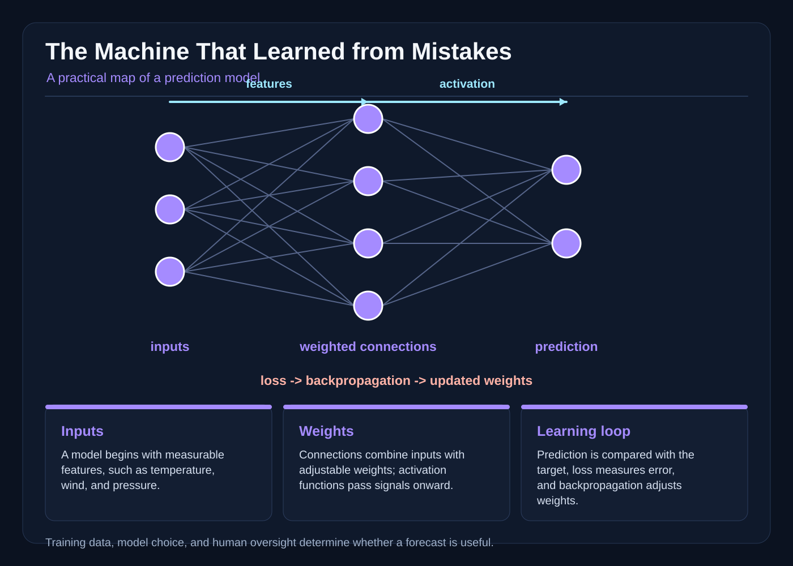

# The Machine That Learned from Mistakes

On the morning the weather machine said there would be no rain, the town of Bellwether hung its washers on the line anyway.

They had learned not to trust the machine completely. They had not learned not to trust it at all. That distinction took a summer, a flood, and a great many muddy boots.

The machine lived in a round stone tower between the school and the seed market. Its brass face was as wide as a wagon wheel. Behind the face, a loom of copper threads trembled whenever the instruments outside recorded the sky. The threads did not know they were threads. They carried numbers from one brass gear to the next, multiplying, adding, and passing values forward until a needle at the center settled on a number between zero and one.

Zero and one were simply the ends of its scale, not tickets into the future. A number on that scale was a score, and a score was not automatically the chance of rain. To call 0.6 a sixty percent chance, someone would first have to gather days the machine had never trained on, find the days whose scores fell near 0.6, and see how often rain actually followed them. The tower’s archive was not yet such a set, so its numbers were raw scores waiting to be checked. The machine did not know what rain was. It did not know the town, the river, or the names of the people who lived there. It had no intention when it moved a needle. It had no plan to protect anyone. It was a calculation arranged so carefully that its result could help people make a decision.

Nara Venn, who repaired the tower’s roof and cleaned its lenses, found the machine making that same calculation at breakfast.

The brass face read 0.08.

“Low score,” said Nara.

The washer line, however, was already a battle against the wind. On the wet morning, a clerk had recorded a pressure reading with a cracked seal. The machine had received a number that looked valid, though it was not. It also lacked one important kind of weather that the old records had almost never shown: a river storm arriving from the east.

Nara touched the housing. The copper threads were warm from the machine’s work. She could hear their faint metallic chorus, like rain heard through a wall.

The 0.08 was not a promise, and it was not yet a probability. It was a raw score built from inputs that might be wrong and weights that had never been checked against held-out weather resembling the day ahead. Until that test was done, the honest description was a low score, not a small chance.

The town’s weather council met beneath the tower that afternoon. Farmers wanted permission to spray the orchards. The ferry keeper wanted to know whether the river would rise. Schoolchildren leaned through the doorway to hear whether the annual lantern procession could continue.

Sera Holt, who kept the official weather records, spread her worn ledger across the table. She was seventy-three, patient in the way of someone who had measured clouds for fifty years, and unimpressed by brass.

“The machine is not the air,” she said. “It is a map of the air we have shown it.”

“Will it rain?” asked a farmer.

“I don’t know yet.”

“Will the machine know?”

“It will give us a number. That is not the same thing.”

The council had asked Nara to explain the machine’s workings. She had been apprenticing in the tower since she was twelve, first polishing glass, then tracing wires, then writing down the values the machine produced. She had never been allowed to change the machine’s settings alone. Her teacher, Master Iven, said that a machine that was easy to change without explanation was only a machine that was easy to blame.

Nara drew a small diagram on the slate. She drew the sky first: temperature, wind speed, humidity, pressure, cloud cover, and the season. Then she drew a row of boxes between the sky and the needle.

“Every forecast starts with inputs,” she said. “Those are the numbers measured outside. A number is only a measurement. It is not a fact about the whole future.”

She pointed to the first box. “The machine has many connections. Each connection has a weight, which is a number that says how much one value should influence another. A stronger weight has a larger effect. The connections do not carry labels such as ‘wind’ or ‘humidity.’ They carry values, and their weights are adjusted through training.”

A farmer frowned. “Adjusted by whom?”

“By the training process. We show the machine examples where the answer is known. We show it the weather readings from before a rainstorm, and we also show it whether rain actually fell. It makes a prediction. We measure the loss, which is a number for how wrong that prediction was compared with the observed result. Then we use backpropagation to calculate how each earlier weight contributed to that error.”

Master Iven traced the arrows on the slate. “Backpropagation is not the machine looking backward in time. It is a procedure for assigning responsibility to the connections. The error is passed through the calculation, and the weights are nudged to reduce the loss. Repeating that on many examples can make a useful pattern.”

The machine’s architecture was a set of simple steps. Each layer received values, multiplied them by weights, added a bias, and passed the result through an activation. An activation was a function that shaped the value before the next layer used it. It could let a strong signal through, squash it into a useful range, or introduce a bend that let the network represent relationships more complexly than a straight line.

“Activation is not waking up,” Nara said, because one of the children had raised a hand. “It is a rule applied to a number. A weight changes influence. An activation changes the range or shape of that influence.”

The needle’s 0.08 had been the result of many such operations. No single thread had announced rain or no rain. The final number was a prediction assembled from measurements and learned relationships.

“That sounds like a very complicated abacus,” said the ferry keeper.

“It is,” Nara replied. “And the abacus needs a ledger.”

The ledger was the training data: years of readings collected at dawn, noon, and midnight, with the weather that followed. It included rain, snow, fog, dry spells, and storms. It also included mistakes. A thermometer had been moved into the sun. A gauge had been read at the wrong hour. A clerk had copied a minus sign in the wrong place. The records were not perfect, and no one could make them perfect without changing the past.

At first, the machine had done poorly. Master Iven had trained it on the first thousand records, adjusted the weights, and seen the loss fall. Then he had trained it longer. The training examples became almost perfect: the machine could reproduce the old days, predicting one remembered gust after another.

But the next year’s weather was not the next year’s copy. A strange lake breeze appeared in spring. The machine had never seen enough of that pattern in the old ledger, so it gave the new breeze too little weight. It predicted a dry market day, and a downpour arrived just as the farmers unloaded their apples. The festival lanterns were drenched. A footbridge near the lower orchard washed out, and the bridge keeper’s son was trapped on the far bank until dusk.

The council demanded that the machine be replaced.

Master Iven refused. “It has learned the old weather too well,” he said. “That is not the same as being ready for the weather ahead.”

Nara did not understand until he opened the training ledger on a long table. They had used every record, including the final handful they meant to save for checking. During training, the machine’s loss had kept dropping. The output had matched each known result more closely. Yet the machine had become too closely fitted to the examples.

“If we keep adjusting after every mistake,” Iven said, “it can memorize details that will not matter tomorrow. A particular gust from a particular year is not a law of weather. If the training set is too small or too repetitive, the machine may chase those details. That is overfitting.”

He showed her two columns. The first held the records used while training. The second held records kept back, with their outcomes hidden until the adjustment was finished. On the held-back column, the machine’s predictions were worse than Sera had hoped.

“The training loss can keep improving while real performance stops,” he said. “A high score on practice is not proof of skill on the next day.”

That afternoon, the council gave the tower a new rule. The machine could never be the only voice in a warning. Its readings would be shown beside the raw observations, and a person would sign every public forecast. The council would keep some records hidden during training so the machine could be tested on weather it had not memorized. People would also compare the machine with simpler methods, such as looking at the sky and reading the river.

The rule felt slow. Decisions took longer, and no one liked the phrase “uncertainty” on a market notice. Yet after the washed-out footbridge, the town trusted its own feet more than it had before.

Nara began keeping a field book of the machine’s mistakes. She did not write that it was stubborn, lazy, or clever. She wrote things she could check: the pressure had fallen quickly, the river smelled of clay, the western sky had looked dry at noon, and the machine had given 0.08 because its pressure input had been wrong. She wrote whether the forecast had helped someone prepare and whether the people responsible for the warning had listened.

The book was not a confession of guilt. It was a way of making uncertainty visible.

The first storm of autumn arrived on a Tuesday. Sera stood on the tower stair with a barometer, a wind vane, and a notebook. The machine’s brass face moved from 0.21 to 0.34 as the afternoon wore on. The score was rising. That was not a promise of disaster, and without a calibration check it was not a probability either. It was a signal that the readings in front of the machine had shifted toward the values it usually saw before wet weather, which was a reason to go and look harder.

Nara watched the number climb. Then she noticed a missing reading from the eastern sensor. The machine had treated the absent measurement as if it were an ordinary value. She pulled the plug before the machine could present a confident answer.

“Unknown,” she said, writing on the board beside the display. The word looked small against the machine’s enormous certainty.

The council used it. The bridge was closed before the water rose. The ferry keeper tied the small boats higher. People moved seed crates from the low shed. The rain arrived before midnight, but no one had to discover the machine’s mistake while standing in a flood.

The machine had provided a useful rising number. The people had supplied the missing observation and the action. Neither part was invisible.

That did not settle every argument. During the next dry week, a merchant argued that the machine had been wrong to raise any warning at all. “A forecast is not a promise,” he said.

“No,” Sera replied. “It is information with a known quality. We decide what to do with the quality.”

Nara realized that a prediction could be wrong and still be useful. A warning could miss the most dangerous details and still give people time to prepare. Likewise, a high score did not erase the need for observation. The score had to be carried together with the reasons the score itself might be wrong.

When the next training season began, the council changed the process. They gathered more records, including hail, hot nights, sudden cold, and storms that came from directions older files had ignored. They corrected obvious errors, but they did not erase inconvenient readings. They marked uncertain records instead of pretending they were perfect. They divided the data so that related days did not accidentally appear in both training and testing. A gust recorded at dawn and the same gust recorded at noon needed to be treated as connected, or the machine could receive an unfair advantage.

Nara helped write the training instructions. She did not call the machine clever. She called it a model: a set of mathematical rules whose adjustable numbers had been shaped by examples. Its performance depended on the examples, the measurements, the measurement process, and the judgments of the people who selected what to include.

Sera kept three kinds of doubt in separate columns of her own ledger, and she made Nara learn the difference. The first column held the weather’s own variability. Two mornings with nearly identical readings could still end differently, because the air is full of small changes that no ledger records and no amount of extra data can pin down. More examples could shrink the model’s error; they could not make the atmosphere itself obey the forecast. The second column held the model and its inputs: a missing reading, a cracked seal, an archive that contained almost no lake storms, a set of weights tuned for one climate and asked to work in another. That kind of doubt could often be measured and reduced. The third column held the forecast probability, and it stayed empty until calibration.

On the last afternoon before the winter storm, the machine’s needle stood at 0.63. Sera’s calibration sheet, built from held-out days the model had never trained on, showed that scores in that range had been followed by heavy rain only a little under half the time, because the archive contained few lake storms and the model had never learned to raise its score for them. The raw number overstated the risk; the column marked model and input uncertainty explained why. Sera wrote the limitation beside the needle. Nara added the river’s rising level and the fact that the eastern sensor was reading again.

The council did not ask the machine for a vote. It asked what the evidence could support. Now that a probability had been established, they could say that on comparable past days rain had arrived a little under half the time at this score, and that the atmosphere itself remained unpredictable enough to justify caution. They issued a warning with a range rather than a single number. They opened the high shelter, checked on neighbors, and moved the schoolhouse children indoors. The rain arrived, heavy but not catastrophic. A smaller branch in the east might have fallen if the warning had waited for a brighter score.

Afterward, the farmers argued that the warning had been too cautious. The ferry keeper said the cost of preparing was smaller than the cost of a washed-out bridge. Sera listened to both. She wrote in her own ledger: the machine predicted a number; the machine did not choose the response. People chose the response and owned it.

Nara repaired the cracked pressure seal and installed a second gauge. She did it because a number entering the network had been wrong, not because the network had misunderstood the sky. The distinction seemed less poetic than the old songs, but it made the work possible.

The machine continued to tremble behind its brass face. Day and night, it multiplied values, passed them through its activations, and produced a prediction. It could be improved by changing weights. It could be damaged by bad data. It could be fooled by patterns that existed only in the past. It could not tell anyone what a cloud meant.

That was why there were people beside it.

The next time the needle moved, Nara did not reach for the lever that would make it more certain. She checked the instruments, wrote down the missing information, and carried the machine’s answer into the room where the town was waiting. Some numbers supported a warning. Some numbers asked for another observation. None of them removed the need to look, ask, and answer for the decision.
