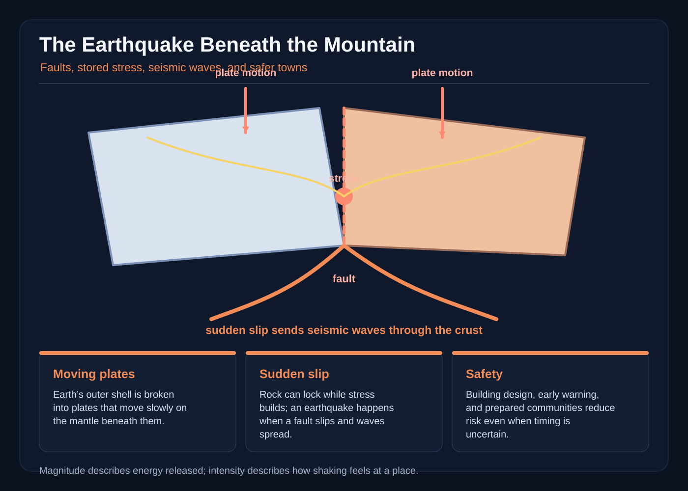

# The Earthquake Beneath the Mountain

The first sign was a blue light under the mountain.

It appeared after midnight, below the old mineral road, and shone through a seam in the snow. Nia Venn saw it while walking home from the observatory. She stopped between the dark pines. The light was not a lamp and not a moon reflected in ice. It pulsed once, twice, then vanished behind the stone.

When she told the town, nobody laughed. Caldera Vale had a name for that light: the mountain’s blue cough. Grandmother Venn had used it to frighten children away from unstable mine shafts. Nia, a geology student returning home for the summer, knew better. She also knew that a legend could point toward a real measurement.

By dawn she had borrowed a truck from the town’s water department and collected four people: herself; Tomas Rhee, an engineer who repaired the school; Asha Bell, a high-school student who kept a weather station; and Mr. Ilyan Petrov, the last surviving worker from the abandoned slate quarry. The quarry had closed before Nia was born. Its machinery had been buried under scree, but its tunnels still opened like black mouths beneath the mountain.

“Blue light means an old pocket of gas,” Asha said. “Sometimes gas glows.”

“Glowing gas would need the right conditions,” Nia replied. “And the light is underground.”

“So we are looking for a mountain that breathes glowing air.”

“We are looking for evidence,” Nia said. “Then we decide what the evidence means.”

The road climbed through a forest of firs. Beneath their roots, the mountain rose in folded layers of limestone, shale, and granite. The valley itself was a narrow shelf of old river gravel. Far below, a river had cut a dark canyon; above, snowfields held the peaks.

Nia had grown up hearing that the mountains were old bones. Now she studied them as records of motion. The rocks were not still. They were carried, pressed, lifted, and ground along by the moving plates of Earth’s outer shell. A plate can move at the speed a fingernail grows, but today’s few millimeters belong to a process that, over millions of years, folds whole ranges and builds mountains. The valley did not need to sit directly on a plate boundary for the rocks around it to feel stress. Mountains can transmit forces from distant boundaries through faults and rock bodies.

At the quarry, the first hard sign was a bent survey pin.

It was a brass pin embedded in concrete by a county crew, supposedly marking a safe distance from the quarry face. Asha placed a handheld GPS receiver beside it. The receiver found satellites, measured travel times for their signals, and calculated a position. On the paper map, the receiver and the pin were both at the same point. When Nia compared the receiver with a second one held twenty meters away, the two positions disagreed by a few millimeters.

“A few millimeters is not a monster,” Asha said.

“No,” Nia said. “But a few millimeters every year can add up.”

She did not know how many years. That was the trouble. A modern receiver could show the present position, while an old survey showed where people had once placed a mark. The difference might be movement of the marker, a mistake in the old survey, a change in the receiver’s view of the sky, or real movement of the ground. No single number could choose among those explanations.

They returned to the observatory, a round stone building with a copper roof gone green. Inside, a long table held maps, notebooks, and a drum recorder that looked like a metal barrel lying on its side. A silver needle rested above a roll of smoked paper. Nia’s grandmother had taught her how to read the drum: a pen attached to the ground shook when the floor shook, and the shaking drew a line.

The drum had been quiet for years. That night, as the team entered, the needle jumped and scratched a short, jagged sentence.

Asha checked the clock. “Did someone bump the table?”

They waited. Nothing happened. Then the needle jumped again, drawing three faint wiggles and one long line.

Nia leaned close without touching it. “That is a recording of ground motion,” she said. “A small event, or something else that made the instrument move.”

The old worker, Mr. Petrov, watched from the doorway. “The mountain used to speak,” he said. “Not words. A sound in the stone. My father said it came before the bad years.”

“Your father may have called every unevenness a bad year,” Tomas said. His voice was gentle. He was holding a flashlight against the recorder’s case, checking that the drum was level.

Nia looked at the paper. The line was too small to read as a pattern. “We can call the old belief a warning, or we can call it a clue. We cannot call it a cause.”

For three days they followed signs that might have been made by the fault and might have been made by people.

At the north orchard, a row of pear trees leaned downhill. The trunks curved in the same direction, but their roots were tangled with irrigation pipes, and the hillside had been cut for a road. Tomas used a plumb line to show that the lean was not enough to prove sliding. Asha found fresh scrapes on a concrete irrigation tank. The tank was leaning, but its base had been undermined by a wash during the previous winter. Nia marked both possibilities on a map and crossed out neither.

At the old bridge, a stone parapet had split in a clean diagonal. A road inspector had blamed a truck that struck the guardrail. Nia measured the crack with a tape and photographed it beside a ruler. The break was newer than the guardrail damage. Still, one crack could have many causes.

At the quarry’s upper gallery, they found a line of crushed white stone. It ran for eleven meters, then disappeared under a wall of shale. Nia kneeled and looked at it through her hand lens. The rock was powdered, not melted. She could not say whether the crushing came from a fall, a blast, or a tiny slip along a joint.

Then Asha noticed a series of tilted stakes in the meadow. The town had installed them twenty years earlier to monitor slope movement. Each stake leaned a little farther downhill. The lower ends remained in the same line, but the tops had moved. Asha compared the older photographs with the present view. The change was visible if you knew where to look.

“Creep,” Nia said.

“Creep of what?”

“Of the ground, slowly. Faults do not all behave in one way. On some sections, the two sides slide a little at a time. On locked sections, friction keeps them still while stress builds.”

The explanation was important, but she kept her voice low. The mountain was not a simple machine with a spring inside it. Rock has strength, and stress changes across the fault. Some faults creep at the surface while deeper portions remain locked. Some stick and slip in episodes. Scientists study the local pattern instead of assigning the entire fault a single personality.

They lowered a small vibration sensor into a borehole drilled near the meadow. The sensor was connected by a cable to a recorder in a weatherproof case. It could measure vibrations too small to feel and record the time they arrived. Nia did not call the wiggles “small earthquakes” until the instrument had been calibrated.

The calibration came on the fourth night, during a brief tremor. Cups slid across a table in the town hall. A picture fell from a nail. The tremor was over before most people had decided whether it had happened. Nia watched the trace on the drum, then looked at the town’s emergency message: several residents had posted shaking as weak, some as none, and one person near the river had described hard jolts.

“Same event?” Asha asked.

“The instruments say yes, within the time they can resolve. The people’s answers are different.”

Magnitude and intensity were not competing measurements. Magnitude described the size of the source, using the amplitude and pattern of the seismic waves recorded by instruments. Intensity described the observed effects at a particular place: what a person felt, what fell, and how a building responded. One event had one magnitude, but its intensity could vary from place to place. Distance from the source mattered, as did the ground beneath a place. Soft sediment could shake more strongly than hard rock. A sturdy building and a tall, flexible one could respond differently. Intensity scales turn observations into categories, but they cannot be carried from house to house as if everyone felt the same jolt.

Nia explained this to the town meeting with a paper strip. She drew one dot for the fault, then placed three small buildings at different distances. “The dot sends out waves. The buildings do not receive an equal share. We can measure the source with sensitive instruments, and we can ask what happened here, there, and everywhere between.”

Mr. Petrov stood. “So why did the mountain light?”

The room looked at Nia.

“It is a real light in a legend,” she said. “I saw it. We did not measure its brightness, its spectrum, or its position accurately enough to explain it. A story can preserve an observation without explaining its cause. We should not use the light to claim that a disaster is coming.”

That answer made the room uneasy. People wanted a cause and a date. The instruments offered traces, not prophecy. A fault might produce many small events, and a long quiet interval might mean that a section was locked; neither fact could tell them exactly when or how large the next movement would be. Even a fault map was a model based on observations, not a guarantee of future behavior.

The blue light returned on the seventh night.

This time it shone under the observatory’s stone floor, in a vein no one had noticed before. Asha lowered a lamp. The rock at the vein’s edge was polished smooth, and the light appeared to pulse in time with the team’s breathing. Nia’s grandmother had left a brass hand lens in a drawer. Under magnification, the vein held thin crystals of quartz, feldspar, and a dark mineral that reflected the lamp in blue.

“Could it be a reflection?” Tomas asked.

“The lamp is not blue,” Asha said.

“Could the crystal be reflecting the sky?”

“It is night.”

The light brightened. A low hum rose through the floor, too regular to be wind. Mr. Petrov took a small notebook from his pocket. His family had recorded the blue light for five generations. The earliest entry described a glow after heavy rain. A later entry described it during quarry blasting. The most recent one said it had appeared before the tremor four nights ago.

Nia copied the words carefully. “The old accounts are not measurements,” she said. “They are clues. A clue can be useful without being proof.”

She placed a temperature sensor, a light meter, and a vibration recorder beside the vein. None showed a signal that matched the glow. The light was still a mystery, and she wrote that word beside the observation. Then she and Tomas moved a heavy steel plate over the exposed vein. The glow disappeared. When they removed the plate, it returned.

“That proves the vein is the light’s location,” Tomas said.

“It proves a relationship under this one test,” Nia replied. “The plate may block a line of sight, or the light may depend on the crystal’s orientation. We do not choose an explanation because it is the one we want.”

On the following morning, the team found a new crack in the observatory floor. It crossed the room in a straight line, then turned at a sharp angle. The quarry worker said the fault must be waking. Asha said it could be settlement under an old drain. Tomas said the building needed a structural engineer, not a prophecy.

Nia asked the town council for a meeting. She brought a map of the local faults, a timeline of measured positions, and a page of photographs. The map showed several possible active structures, not one magic line. The timeline showed measurements that were sparse and uncertain. The photographs showed damage that could be explained in more than one way.

“The town has three choices,” Nia said. “We can pretend we know when the mountain will move and sell that certainty. We can pretend there is nothing to learn. Or we can measure, prepare, and improve what we can control.”

A council member asked what the team proposed.

“Install a small, public network of sensors,” Nia said. “Use careful surveys and existing maps. Ask engineers to inspect the school, the water tanks, the bridge, and the homes with unreinforced masonry. Retrofit the most vulnerable public buildings first. Teach residents to drop, cover, and hold on during shaking, and to avoid unsafe buildings afterward. Then keep the records, even when the instruments are quiet.”

Tomas opened a roll of blueprints. He had already drawn a plan for the school. The old assembly room had heavy shelves against an exterior wall and a narrow stair that ended in a locked door. The retrofit would not make the school earthquake-proof. It would improve the building’s chances by tying parts together, reinforcing weak walls, securing shelves, widening the stair doorway, and making exits easier to use.

“Could we prevent the next earthquake?” a child asked.

Nia shook her head. “No one can do that with a brace. A brace helps a building ride through shaking more safely. It does not remove the stress in the rock, and it cannot promise a quiet night.”

That evening, the team carried sensors to the school, the reservoir, and the north orchard. Asha calibrated the instruments. Tomas bolted a new brace across the assembly-room ceiling. Nia and Mr. Petrov set a small marker beside the suspected fault trace without breaking the ground. At the quarry, workers placed warning signs at the old tunnels and cleared loose stone from the public trail.

The work took weeks. It felt slower than the mountain. Rain filled the ditches. Trucks came and went. The town did not become fearless. People still asked about the blue light, and the light still came on a few nights, always hidden by stone. Mr. Petrov began drawing its pulses in the margins of his notebook. Nia told him that a person could be attentive without being certain.

One morning, a moderate event shook the valley. It was strong enough to rattle windows and make water ripple in the reservoir, but not strong enough to bring down a wall. The town’s instruments drew a busy trace. A web page later labeled the event with a single magnitude, and posts on a message board argued about whether it had been stronger or weaker in one house than in another.

In the school, the bolted ceiling held. The shelves stayed against the wall. The widened stair opened into the courtyard. A water tank flexed slightly but did not spill. A grocery store with an unreinforced brick front lost a corner of its façade, and a block fell across the sidewalk. No building was declared safe merely because it survived. Inspectors marked the damaged store, and the council used the report to choose the next retrofit.

The distinction mattered to Nia. Survival on one day was not a promise for the next. Better connections, continuous load paths, secure contents, and good construction could reduce danger, but they could not erase an earthquake’s energy. Safety came from many choices, not one magic charm.

At dusk, the team returned to the observatory. The blue glow had not appeared, but the instruments showed the fault’s slow movement continuing in small steps. The maps now contained more points than before, and each point had a name, a date, and a note about what the instrument actually measured. The town had not learned the mountain’s future. It had learned how to listen without pretending to know the answer.

Nia placed her grandmother’s brass hand lens beside the dark vein. In the crystal, a small point of light glimmered and went out. She could have called it a warning. She could have called it a blessing. Instead she wrote in the field notebook: *Observed, unexplained. Continue measuring.*

Outside, the new brace on the school caught the last sunlight. A child rang the bell, and its note traveled across the valley without asking the mountain for permission. The fault remained hidden, the plates continued their slow work, and the town had chosen the only future science could promise: not certainty, but a better way to meet uncertainty.
