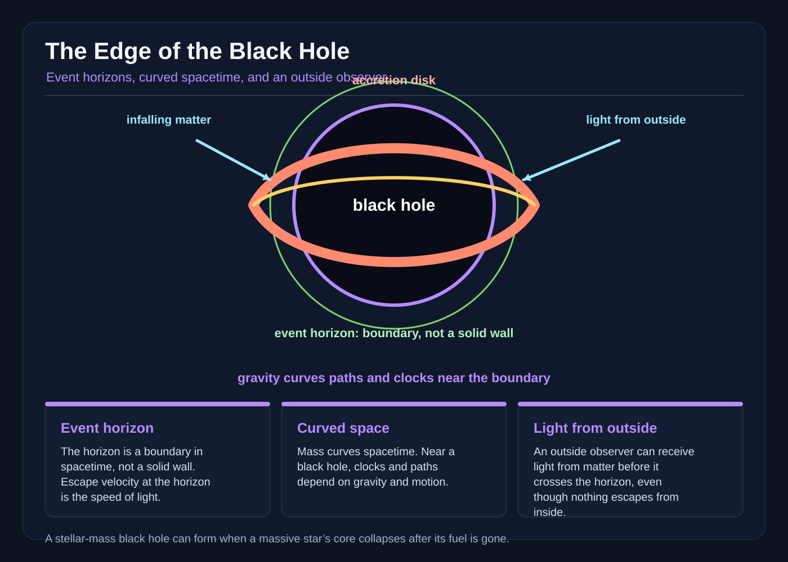

# The Edge of the Black Hole

The rescue crew called themselves the Lanterns, though their ship carried no flame. It had a white hull, a blue stripe, and a name painted twice over the old one: *Aster Vale*. The name had belonged to a survey vessel that had gone beyond a moon in search of methane ice. The star that had once warmed that moon was gone. The ice was gone. The vessel had vanished too, leaving a distress beacon that repeated every eleven seconds for six days.

Commander Ilyan Vey set the receiver beside his palm. It gave a thin carrier pulse, then a silence where a voice should have been.

“Source position unstable,” said Sere, the navigator. Her hands hovered over the plotting table. The display showed a small blue mark near the edge of a black region, though the display was not a photograph. It was a model assembled from radio observations, X-ray measurements, and equations no one had been close enough to test with a personal instrument.

“Distance?” Vey asked.

“Twenty-one million kilometers to the last reliable fix.”

“Time dilation?”

“Unknown. The estimate depends on the mass, the spin, and the path.”

She did not say *if*. Models were not gods. They were instruments that could be wrong in orderly ways.

Vey looked through the forward window. At the center of the starfield was a pale wound. Around it, distant stars had been drawn into long, bright parentheses. The blackness seemed to possess depth because the light beside it had been bent. The accretion disk blazed across the ship’s plane, a whirl of gas and dust crossing from left to right. The instrument painted its X-rays in false colors, then printed a warning: *The target is inside the forbidden curve.*

“Define forbidden,” Vey said.

“A boundary where the model says an outward path can no longer reach us.”

“That is not a definition for a pilot.”

“It is the best one we have.”

The black hole had no visible rim, no shell, and no gate. The boundary was called the event horizon. It was not a wall. Nothing could be touched there. A ship crossing it would not see a flash or a barrier; it would simply continue along its path. The future would divide, with the ship’s future leading inward and no future in that region leading back to the crew outside.

Sere brought up the mass estimate. A stellar-mass black hole forms when the core of a massive star collapses. This one was estimated at a little over ten Suns, though the uncertainty was large. General relativity relates a black hole’s mass to the radius of its event horizon. For a nonrotating black hole of ten solar masses, that radius would be roughly thirty kilometers. The number described a boundary in the external geometry, not a dark material surface waiting at thirty kilometers.

Vey disliked how small the number made the danger.

Sere enlarged the model until its assumptions became visible. The black hole’s mass was inferred from the orbit of the companion star and from X-ray observations of the disk. A larger mass would push the horizon farther out and change the timing of every signal. The black hole’s spin could tug the geometry around it, but the data could not yet distinguish a rapid spin from a slow one. Vey understood that uncertainty was not an inconvenience. It was the landscape itself, seen through instruments that could only report what they could measure.

The rescue ship entered the outer part of the accretion disk. The gas was not a solid ring. It was matter with angular momentum, moving in overlapping orbits while turbulence and magnetic fields fed energy into radiation. Friction and dissipation in the flow heated the gas until it shone in X-rays. The black hole itself was dark. The light came from matter losing energy as it spiraled inward, some of that energy leaving the system and some carrying angular momentum away.

Matter near the inner disk did not fall straight down. It moved sideways, again and again, like water circling a drain. In a rough classical picture, the escape velocity—the speed required to leave a gravitational field—grew as the distance shrank. Near the horizon it approached the speed of light. General relativity replaced the simple picture with curved spacetime, but the intuition remained useful: the required outward speed became impossible. Light was not trapped because it was slow. From inside the horizon, an outward-directed light ray had no future path to the outside.

“Escape velocity is a warning, not a machine,” Sere said. “It tells us why the old picture fails. A spacecraft does not need to exceed some posted number in order to escape. It needs a future path that reaches the exterior. Near the horizon, even a perfect engine cannot make a path point backward toward the stars. The speed of light is the limiting speed for matter and ordinary light, but curved spacetime determines which directions are available.”

“Could we send a message across?” Sol asked. He was the engineer, broad-handed, careful with tools, and unable to leave a mystery alone.

“We can send one toward them,” Vey said. “If they are still outside, it can arrive. If they are inside, it cannot.”

“Then why can we still see the ship?”

The telescope had found the *Aster Vale* near the edge of the disk. Its antenna trailed behind it, a silver thread bent by perspective. A red light blinked. The hull was visible, although the vessel should have been too small for the unaided rescue telescope.

“Because the light we receive was emitted outside the horizon,” Sere said. “Photons can leave the exterior region. The disk is outside. The ship may be crossing the boundary, or it may be just outside it. A final image can continue to arrive after the ship has crossed. A signal sent from inside cannot come back.”

When photons climb out of the black hole’s strong gravitational field, they lose energy in the journey. Distant observers measure them at a lower frequency, a shift toward the red end of the spectrum. The same effect makes the carrier seem to sag even when its transmitter is still outside. Redshift can reveal a black hole, but it cannot tell the crew whether the final image came from a place they could still reach.

The telescope’s image was therefore a history, not a live view. Every photon carried the moment it left the survey ship. The crew could watch an old event arrive, even while the ship that had sent it moved beyond reach. The distinction was painful because seeing a hull and hearing a voice are not the same act. One is a surviving wave of light; the other requires a new wave to complete its journey from the sender to the receiver.

The carrier from the beacon pulsed. The blank after the carrier was longer than it had been the previous day.

Sere opened a field-notes screen.

“Field note,” she said. “The observed increase in interval may be caused by a slower source clock relative to distant clocks, by the changing travel time of the signal, or by both. The black hole is strongly suspected to be responsible for gravitational redshift, but the beacon’s data are too damaged to separate every effect.”

Nia, the medic, looked up from her medical kit. “A person inside would not feel time stopping.”

“No,” Sere said. “A person’s proper time—the time measured by a clock traveling with that person—would continue. Compared with our distant clocks, though, it would accumulate less. The stronger the gravitational field, the larger the difference. A distant observer would receive increasingly delayed and redshifted signals. The infalling person would not see their own clock freeze.”

Nia’s hand rested on a photograph of the survey crew. Six faces, six names, six lives reduced to a carrier wave.

“So rescue is possible only before the crossing?”

“Rescue is possible only before the crossing and only while the trajectory still leads outward,” Vey said. “A person outside the event horizon can be reached, but only if their path has a future that intersects the exterior. Once inside, no external ship can pull them back, because no outward path remains.”

The ship passed a bright arc in the starfield. One background star had been stretched into a luminous curve around the black hole. It had not physically become a ring. The geometry between the rescue ship and that light had changed. In general relativity, gravity is the curvature of spacetime. A free object follows paths shaped by that geometry, which is why light can bend, clocks can disagree, and a region can have routes that do not lead back to the region from which they began.

Nia asked whether the rescue crew’s clocks could be wrong. Sere explained that the clocks were not broken. Each measured its own proper time correctly. The difference appeared when the clocks were compared through signals. To distant observers, a clock deeper in the gravitational field could appear to run slowly, and its light could be delayed and redshifted. A person falling inward would experience no corresponding dramatic pause in thought or heartbeat. Relativity did not make a private timepiece surrender its seconds; it made the relationship between distant clocks and signals depend on the path through space and time.

Sol checked the rescue ship’s accelerometers. They showed no sudden wall of force. The black hole did not reach out and seize the ship. It changed the geometry around the ship. The differences in gravity across the hull were tidal forces. For this ten-solar-mass remnant, tidal stretching becomes dangerous to a human well outside the event horizon; a person at the rescue approach limit would be pulled apart, not merely uncomfortable. The rescue plan therefore kept people outside a modeled estimate of the human fatal-tide radius. A compact spacecraft could cross that radius briefly behind shielding, but only on a trajectory that still led outward. Another burn would have made the approach lethal. Closer in, the near side and far side would feel different accelerations, stretching a body lengthwise. A larger black hole could move that fatal radius farther out, but it would not make the impossible route possible.

The rescue plan changed three times before the disk’s inner weather. First, a beacon pod would be placed at a safe margin outside the modeled event horizon and a cable would pull the *Aster Vale* back. Then a drone would collect the vessel in a magnetic cradle. Finally, the plan admitted that the target’s position was uncertain and relied on a rescue burn timed to the last beacon.

Each plan hid a dangerous assumption. A cable needed two ships outside. A drone could not turn around inside. A beacon showed a position, not a present one.

Teo Rusk, the communications officer, had been one of the six. His face in the archive was narrow, his smile lopsided. His voice now came only in static.

Vey ordered a burst toward the target. The rescue ship’s antenna sent a sharp pulse of visible light. It was a flash bright enough to be seen by a camera pointed at the right patch of sky. The photons crossed the curved region between the ships. The telescope caught a return flash from the *Aster Vale*.

For three seconds, the crew allowed themselves hope.

Then the image changed. The survey ship’s antenna stretched. Its hull seemed to become an ellipse, not because it had transformed but because the rescue telescope was receiving light along paths bent by gravity. The red beacon blinked again, its interval longer.

Sere plotted the new position. “The vessel is near the inner edge of the disk. The exact horizon is uncertain, but it is not safe to follow the apparent path.”

“Can we reach the person?” Nia asked.

Vey magnified the image. A suited figure hung where the projection placed it beside the hull. The suit had separated during the same failure and lagged hundreds of kilometers behind. The model placed it outside the human fatal-tide radius, but still on a trajectory that could lead outward. A hand moved against the visor, perhaps trying to attract attention, perhaps simply following the slow tumble.

“We can try,” Vey said.

They brought the rescue ship alongside the suit’s lagging orbit. Matching velocity was not the same as matching position. The black hole changed the path of the *Aster Vale*, and the rescue ship’s engines burned in short, exact pulses. Each burn was a negotiation with geometry. Sol watched the tether line and called corrections.

The approach felt like threading a needle while the needle was being heated. The rescue ship’s shielding strained against charged particles in the disk. Its attitude control fought the unequal pull across bow and stern. Sol’s display showed the tide: not a single acceleration, but a changing difference between one side of the hull and the other. The fatal-tide radius lay outside the modeled event horizon. The crew had kept the people beyond it; the ship could make a brief crossing behind shielding, but a delayed burn would have turned the maneuver lethal. They could not turn the event horizon into a place from which a cable could pull.

“Thirty degrees,” he said. “Now twenty. Hold.”

The tether reached the suit and caught its harness. The line tightened. The figure’s gloved hand closed around it.

Then the horizon alarm sounded.

The alarm did not announce a wall. Sere’s trajectory solver announced that the *Aster Vale* had crossed the modeled event horizon: its future no longer intersected the exterior region. The suit and the person were still outside it, and the suit’s trajectory still led outward. The rescue computer marked a red curve through the vessel’s trailing section.

“Cut power,” Sere said. “If we keep thrusting, our return path bends inside the modeled event horizon.”

“Cut tether,” Nia said. “We cannot pull them across.”

Vey looked at the red curve, then at the hand on the tether. “Burn,” he said. “Now.”

The engines fired. The rescue ship moved away from the black hole. The tether tightened around the suit’s harness. For an instant, the figure hung between the ships, a bright speck against the black. The *Aster Vale* rolled behind, its windows reflecting the disk in a broken streak. The tether pulled straight, then parted.

A dark notch appeared along the suit’s side. It was not a cut. It was a distortion in the image, as though the camera were looking through a curved sheet of air. The suit came free and struck the airlock with a heavy sound.

Vey sealed the lock.

Teo Rusk was unconscious. Nia found no pulse, then a flutter, then a stubborn beat. His oxygen was nearly gone, and the suit’s visor was cracked. The face behind it was Teo’s, older and paler than the archive photograph.

“We have one,” Nia said.

Outside, the telescope still showed the *Aster Vale*. Its image lingered near the red curve, dimmer with every observation. The rescue ship could receive that light because it had left the vessel while the vessel was outside the horizon. The photons carried a past event. They were not proof that anyone inside could still answer.

“Do not send another message,” Vey said. “A signal from inside cannot cross outward. We keep the channel clear for anyone still outside.”

The rescue burn had changed their trajectory. If the engines continued, the rescue ship itself would approach the modeled event horizon before it could turn. Vey ordered the engines off. The ship coasted through curved spacetime, carried by its velocity and the geometry around it. The stars stretched. The black center seemed to rise in the window, though the ship was not climbing a slope. It was following a path that curved away from the dark.

Sere compared the rescue ship’s new trajectory with the family of horizon models. The safest route was not the one that passed closest to the black hole. It was the one that kept enough margin for the uncertainty in the mass and spin. Vey understood the decision as a form of navigation: respect the map’s limits, and do not mistake a prediction for a promise.

The ship passed near the horizon but remained outside the model’s boundary. They escaped not by overpowering gravity, but by choosing a future that led outward.

Sere entered the observations in the field notes.

*No physical surface observed at horizon. Boundary inferred from geometry and signal behavior.*

*Light from outside received normally. No new signal received after the final transmission.*

*Increasing interval between pulses consistent with gravitational redshift, signal delay, and possibly slowing of the source clock.*

*Rescue achieved before the surviving person crossed the modeled event horizon, while the trajectory still led outward.*

She stopped at *possibly*. The model was still uncertain. The black hole’s spin could displace the horizon. The last position of the *Aster Vale* depended on a signal that had crossed a region of severe gravitational redshift. No one could prove exactly what the crew had experienced after the final transmission. A distant observer would see delayed, fading light, while an infalling person would continue through their own proper time. Both descriptions could be true.

Teo opened his eyes. “The others?”

Vey told him the truth. The ship crossed the horizon. They had received light from before the crossing, but no new signal from inside.

“Can we send them a message?”

Vey looked toward the black center. “Not from there. Not to there.”

“Then the light we see—”

“Was light sent while they were outside.”

Teo turned his face toward the window. “That is not the same as hearing us.”

“No.”

The answer was a small, necessary cruelty. Relativity did not offer a comforting loophole. From inside the event horizon, no outward signal can reach the rescue ship. From outside, photons emitted earlier can still arrive. A last image is not a message from the far side. It is a message from a moment when escape was still possible.

The accretion disk shimmered beyond the hull. The gas continued its violent, imperfect orbits. Near the inner disk, stable circular motion became impossible for some particles. Matter plunged toward the horizon, radiating energy and carrying angular momentum away. The black hole did not need to chew the gas. The geometry and the loss of orbital energy did the work together.

Vey watched the last glimmer of the *Aster Vale* fade into the dark. It did not strike a surface. It did not pass through a visible edge. The photons carrying it traveled through curved spacetime, were delayed, stretched, and lost among the background light. The ship had crossed a boundary that was not a wall, and the rescue crew had chosen a path that did not.

The rescue ship turned its antenna outward. It sent a final burst toward the disk’s outer edge, where light could still travel away through the surrounding geometry. The signal was not for the *Aster Vale*. It was for any surviving craft outside the horizon and for the station waiting behind them.

On the station’s clocks, the report would arrive delayed. The crew aboard would keep their own time, each heartbeat ordinary, while distant observers compared signals that were increasingly stretched and red. Time dilation was not a spell that froze a person at the boundary. It was the difference between how related clocks and signals behaved along different paths through curved spacetime.

Vey looked back once more. There was no edge to remember, only the darkness and the light that had escaped from the vessel before it crossed. He had wanted to bring everyone home. He had brought one person home, and the visible consequence was a lesson larger than rescue: some paths return. Some paths carry light outward. Some paths do not.
