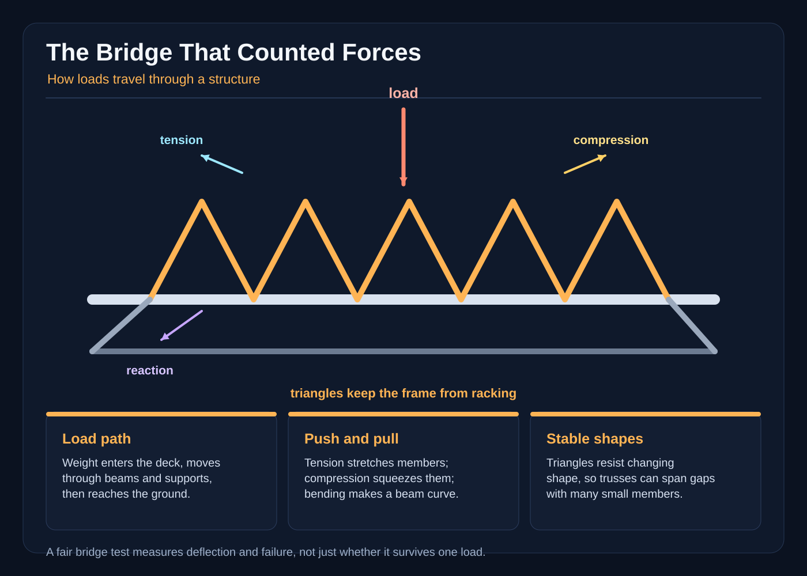

# The Bridge That Counted Forces

The morning the river changed its mind, the village lost its only footbridge.

Not forever. The old stone bridge was still standing on the far bank, but a spring flood had dug a hungry trench beneath the near side. The water rushed through the gap, brown and loud, carrying twigs, buckets, and one indignant duck. People gathered at the broken end and stared across the chasm. On the other side, the road to school, market, and the winter orchard waited uselessly.

“We can build a bridge,” said Mira, sharpening a charcoal pencil. She was eleven, with red boots and a habit of measuring everything she could reach.

“You can build a plan,” said Oren, the twelve-year-old who repaired kites. “A bridge is made of wood.”

“Wood, rope, nails, and hope,” said Tavi, the youngest builder, patting his satchel. “Hope is useful, but it does not make a strong joint.”

The village smith, Uncle Brann, handed them three smooth planks, a coil of hemp rope, a box of iron pegs, and a painted survey board. “The chasm is three paces wide and four deep,” he said. “Build something a child can cross, then prove it can carry a full load.”

Mira drew four points: two banks, two edges of a walking path. “We need supports at both ends,” she said. “The bridge must carry its own weight and the weight of whoever uses it. Those weights are loads. A load is a push or pull acting on a structure.”

Oren tested a plank between two stones. It held one child. When Tavi climbed onto its middle, the plank sagged, then sprang back with a creak.

“That is bending,” Mira said, marking a little arc above the board. “A load in the middle tries to curve a beam. The top can be squeezed while the bottom is stretched, or the other way around, depending on how the beam curves. The sagging middle is the clue.”

“Can we make it bend less?” Tavi asked.

“Maybe. If we make the load travel through several members instead of asking one plank to do everything.”

Their first design was a handsome, flat, full-size bridge. They laid a wide deck across the banks. Beneath it they placed upright posts, two on each side, and nailed the posts to the deck. A rope rail ran along the top to steady the walkers. From a distance, it looked like a neat little house with no walls.

“It has lots of supports,” Tavi said.

“Count them,” Mira replied. “Count the spaces between them.”

There were four posts, but the middle of the span was mostly empty. The deck had to bend there. When a cart passed, its weight pushed down on the boards. The boards tried to pull down on the posts, and the posts pushed back against the ground. Yet the joints were not locked together. A post could lean slightly; one side of a joint could slide past the other. That sliding tendency was called shear.

They agreed to make a full-size test section that matched their real bridge in every important way. They measured a space of exactly three paces between two stone blocks, used the same three planks, used the same four posts, and used the same sizes of rope and pegs. They would place the same weights in the same places for every trial.

“A fair test changes one thing at a time,” Mira said, making a table on the survey board. “If the first bridge fails, we need to know what caused the failure, not guess.”

Uncle Brann set a calibrated spring scale beside the first test. Each sandbag held twenty kilograms of sand, and the builders recorded the mass before placing it. Oren placed one measured bag over the center. The bridge held. Then Tavi placed a second, a third, and a fourth, all in a line across the middle. The deck dipped. One upright post leaned. The rope rail snapped tight with a little thrum.

On the fourth measured bag, the right-hand joint opened. The upper board slipped across the lower one, and the bridge folded sideways into the gap. Everyone shouted at once. Tavi’s sandbags tumbled into the river. The duck quacked an opinion.

For a moment, the builders stared at the broken pieces. Then Mira picked up her pencil. “Nobody humiliated anyone. The bridge told us where it was unhappy.”

They laid the pieces beside the survey board. The deck had bent most. The posts had carried some of the downward push, but the nails had acted like tiny doors. Under the extra load, one joint tried to shear open before the wood could carry the push. The rope rail had helped only a little; it was good at pulling, not pushing.

“Uncle Brann, did we use the wrong materials?” Tavi asked.

“No,” said the smith. “You used a shape that asked wood and iron to do something they were not arranged to do well.”

Uncle Brann found them an old slate and a stub of chalk. “Write what you saw,” he said. “A careful note is worth more than a brave guess.”

Mira divided the slate into four little boxes: load, motion, joint, result. Under load she drew four circles, one for each sandbag. Under motion she sketched the middle of the deck bending down. Under joint she drew two boards sliding in opposite directions. Under result she wrote, “Too much shear at the right support.”

Tavi pointed to the first sketch. “The bags were not all at once.”

“So the last bag was not the mystery,” Oren said. “It just made the weak joint move.”

Mira added a line under the boxes: “The force went down through the deck, into the leaning post, across the sliding joint, and away through the ground.” She drew an arrow for each step. “If we can keep the shapes from changing, the same force will still have to travel, but it will travel through members that can handle it.”

“Tension pulls,” Tavi said, pointing to the rope in the picture. “Compression pushes.”

“And bending is what the deck does while sharing that push and pull,” Mira said. “Shear is the unwanted sliding. A fair test lets us see which one is doing the damage.”

They cleaned the broken bridge and began the new design while the water sang below them.

Mira studied the sketch. “The gap is too plain. We need shapes that cannot lean into a new shape.”

Oren remembered the roof trusses over the village school. A triangle stayed firm when its corners stayed connected. If one side were pulled, another side would be pushed. The pull and push passed through the members, not through a loose hinge.

“Triangles,” he said. “We should build a triangle on each side of the bridge.”

They drew a truss: a bottom chord from bank to bank, a top chord over the deck, and diagonals crossing between them. They marked arrows on the picture. Under a load, some members would be pulled along their length. That was tension. Other members would be pushed along their length. That was compression. The force in one member would lead into the next, then into the deck, the end posts, the abutments, and finally the ground.

“It is like a relay,” Tavi said. “A push doesn’t simply disappear under the bridge. It travels through the structure.”

They built the full-size replacement bridge with two side trusses, a strong deck, and cross-braces that connected the left and right sides. The diagonals formed small triangles. They tightened the rope ties by the same amount on both sides, then checked that each iron peg went fully through its plank and into the post behind it.

Before anyone crossed, they summoned Master Vell, a qualified adult bridge engineer who had repaired the county’s mill bridges. He inspected the abutments, measured the span, checked the wood and every joint, and reviewed the force path from deck to truss to ground. “The bridge may be tried,” he said, “but it is not safe to open because it looks clever.”

Vell recorded the intended worst-case load: two hundred fifty kilograms of people crossing at once. For the trial, the builders weighed fifteen sandbags, each exactly twenty kilograms, for a measured total of three hundred kilograms. That gave a twenty-percent safety margin over the intended load. Vell repeated that bag count alone could not establish safe capacity; the materials, connections, foundations, inspection, and margin all had to be right.

For its fair test, they used this same full-size bridge, the same measured sandbags, and the planned positions: one at the center, the other fourteen evenly spaced on either side. Nothing was moved except the load being added.

The first bag made the deck settle a little. The second found the diagonals. Oren heard a soft wooden hum. The third found the same members. The fourth followed, but the triangles held their corners. The top chord showed a faint bend, and the bottom chord stayed straight. One diagonal tightened, while another pressed into its neighbor. The end posts pushed into the stone.

“It is still bending,” Mira said, watching the middle of the deck.

“Less than before,” Tavi answered. “And it is not sliding apart.”

They added the fifth through the fifteenth measured bag while Vell and the same adults watched from the bank. The bridge held under the three-hundred-kilogram trial load, with its joints and supports still in place. After the bags came off, Vell inspected it again, checked that nothing had shifted, and approved one-at-a-time pedestrian use. They did not claim it could carry every cart in the village: a bag count alone did not establish safe capacity, and the engineer’s inspection and the safety margin were still part of the decision. They marked the tested load on a sign and built a simple barrier.

The real bridge opened before sunset. Mira’s design let walkers step onto the deck without a dangerous bounce. Oren’s triangular sides kept the frame from leaning. Tavi’s careful pegs kept the joints from opening. Beneath their feet, their weight became a load, and the bridge carried it through the deck, along the truss members, down the posts, and out into the banks.

When the smith asked what they had learned, Tavi pointed to the painted arrows on their survey board. “Forces do not vanish just because the bridge looks still. They take a path.”

“And a good shape gives them a safe path,” Mira added. “But a shape can fail, too. That failure is information, not a reason to stop building.”

The last child crossed as the sun turned the river gold. Beneath the bridge, the new water rushed through the old trench, carrying leaves toward the fields. The builders stood on the far bank and listened to the quiet creak of wood under their own weight: not a warning of collapse, but the sound of a structure sharing the work.
