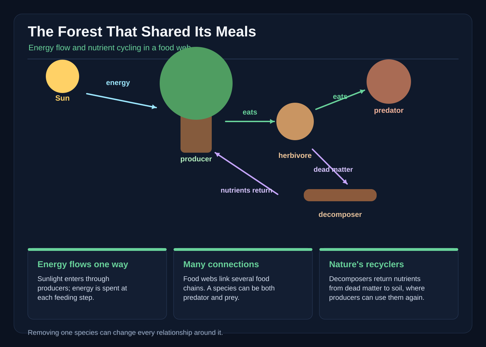

# The Forest That Shared Its Meals

The night before the Lanternwood forest feast, every table came up empty.

Nia found the first clue at dawn. The community garden’s seed trays had been scooped clean, the labels lay facedown, and not a single sunflower seed remained. Farther up the hill, the school’s demonstration garden had suffered the same mysterious theft. A whole row of young willow saplings stood with their newest leaves missing.

“Frost damage,” said her uncle Dan.

Nia touched a cut stem. The edges were ragged but not torn. They had been chopped by teeth.

By the time school began, a knot of residents crowded the forest gate. A crow had found one grain of sunflower seed near the garden, but the trail vanished under blackberry leaves. Someone reported seeing “a shadow with shining eyes.” Someone else claimed the deer had learned to open seed packets.

At the back of the crowd, wildlife officer Mara held up a pale, forked stick.

“It wasn’t a stick,” Mara said. “It was a deer antler shed. And deer have used the garden heavily this week.”

The forest had felt strange for months. On some walks, Nia noticed less birdsong, though she had never counted it from a fixed place. Mushrooms were uneven: some appeared in rings after rain, while others stopped at pale buttons. Then the school garden was stripped almost overnight.

The town council met that afternoon. Mayor Bell held up the old map of Lanternwood. A red line crossed the forest, marking a boundary where wolves had once been protected.

“Too many deer,” he said. “The solution is simple. We remove the wolves.”

Nia’s hand tightened around her notebook. For weeks, she had seen deer paths pressed into the moss and fresh droppings among the willows. Wolves had left wider prints in the mud, but she had not watched one take a deer. The easy answer was also the one that frightened her.

After the meeting, Mara took Nia and three classmates into the trees. “Don’t look for one villain,” she said. “Follow the meals.”

They began with the empty garden. Nia found a patch of ground where acorns had been scratched from the soil. Then they found the first clipped willow. A bright bite mark curved around its tender stem. Nia brushed aside the loose wood chips and photographed it with the old field camera.

Deer eat leaves, twigs, grasses, flowers, fruit, and sometimes bark. A browsing deer can shape an entire understory, especially when many deer use the same winter browse.

Still, a clipped plant did not explain the empty seed trays. On all fours, Nia followed a trail of shiny, dark pellets. One had split open to show a hair and several crushed berries. Wolves eat deer, but they also scavenge and may eat other animals. The scat told the truth of what had passed through, not the whole truth of what was alive nearby.

Beyond a fern-covered gully, they found a deer resting in the shade. Its ears flicked, but it did not run. Beside it, the willows were rubbed and scraped.

Then Nia heard a distant yip.

From behind a fallen trunk, a gray wolf watched them. A second wolf, darker and larger, stepped onto the path. Mara did not chase them. The wolves moved away through the trees, keeping well beyond the children.

“They eat deer,” Tovan whispered.

“So do ticks,” Nia replied. “That doesn’t make the forest only a line of two meals.”

At school, the class began building a food web with string, paper leaves, clay mushrooms, and cards for a deer, a wolf, an owl, a mouse, a beetle, a frog, and fungi. At first someone drew one straight arrow from grass to deer and another from deer to wolf.

“That leaves most of the forest outside,” Nia said.

They added more plants: pines, willows, berries, and fungi. They added animals that ate insects or seeds, and predators that hunted different animals. Lines crossed. A deer might nibble a willow, but a berry might also feed a mouse. A beetle could be food for a frog or bird. Fungi broke down fallen branches, fur, and dung, and some kinds formed partnerships with living roots.

The web was not a map of every species in Lanternwood, and no single web described every season. It was a way to show connections without pretending the forest worked like a single chain.

Ms. Vale, their science teacher, tapped the paper sun.

“Green plants capture light energy and make sugars,” she said. “When a deer eats a willow, some chemical energy moves into the deer. When a wolf eats the deer, some moves into the wolf. Respiration releases energy as heat, and energy is eventually dispersed. Energy enters mostly as sunlight and flows one way; it does not loop back from the wolf to the sun.”

Tovan pointed to the fungi. “What about the dead leaves?”

“Those carry matter, but usable energy still has to come from somewhere. Decomposers use part of the chemical energy in dead material. What they cannot use may be released as heat.”

Ms. Vale tied a blue thread from plant to deer and from deer to wolf. Then she tied a brown thread through fungi, dung, fallen wood, and soil back to the roots.

“Nutrients are different from energy. Carbon and mineral nutrients can be used again and again. Decomposition helps return them in forms roots can absorb. Matter moves around the web.”

Nia studied the brown thread. It made the forest feel less like a set of mouths and more like a busy exchange, but she did not imagine the fungi giving orders to trees. Some fungi grow on plant roots in a partnership called mycorrhiza. Their threads extend through tiny spaces in the soil and can help a plant obtain minerals and water. In return, the fungus receives a portion of the plant’s sugars made by photosynthesis. Other fungi, along with bacteria, feed on dead material as decomposers. Their exact partners and diets differ, and many species remain hard to identify.

“Shared meal doesn’t mean every diner gets the same portion,” Nia said.

For their field-notes scene, the class followed the wildlife officer’s rules and recorded only what they could see. Nia copied four lines into her notebook: clipped willow beside a deer trail; deer hair and berry remains in separate wolf scat; living gray mushrooms under trees; pale, old fruiting bodies in deeper soil. At the edge of the garden, a line of tiny ants carried one fallen seed between two blades of grass. An owl called once in the dusk. Nia wrote, “Other lives use the same space at other times.”

The next morning, they tested an idea. With Mara’s permission, they bent a flexible fence around six willow saplings inside the demonstration garden. The saplings were matched for height, and the soil and watering were the same for all twelve. They left six other saplings outside.

By dusk, the two inside saplings they checked were untouched. Outside, a deer stepped close enough to strip the tender tips from three saplings. The fence did not create a simpler food chain. It changed what one herbivore could reach. Wolves also influence deer numbers and where deer browse, but a fence could not replace a predator or repair every damaged part of the forest.

The class presented their evidence at the next council meeting. Mayor Bell pointed to the wolf photographs.

“Deer destroy the trees. Wolves destroy the deer. Surely that is still a choice.”

Mara nodded. “Population numbers rarely stay perfectly still. Ecosystems are not contests with an exact winner and loser. Wolves are one influence among weather, food, disease, other predators, and the plants themselves. Removing wolves can allow deer to increase, but the result is not guaranteed or immediate. The old counts still need checking.”

Mara placed three objects on the table: a green willow leaf, a deer tooth, and a fragment of bone.

“Here is the mystery. No tooth could make mineral nutrients from sunlight. No wolf could build a leaf. We know deer are browsing the saplings. If the loss of wolves had allowed deer numbers to rise, heavier browsing could have reduced young trees and shrubs. That could have removed food and shelter for some insects, birds, and small mammals, then reduced food for some predators. Deer droppings and carcasses supply nutrients only after material is broken down and reused.”

Nia’s father, a council member, frowned at the photographs. “Then the wolves did this by being absent?”

“No single cause fits every place,” Mara said. “But we have evidence of wolves and heavy deer browsing on these saplings. We do not yet have old population counts to prove a cascade, and we should not claim more certainty than our observations allow.”

The council had one vote remaining. The poison had already been loaded into a locked box. Nia remembered the young wolves on the far path. She also remembered the empty trays, the pale mushrooms, and the stems a deer had stripped outside the fence.

The mayor called her name.

Nia stood. “Don’t remove one more species and pretend the web ends at whatever bites us first. Protect the wolves, finish fencing the young grove, and watch the same places. If deer browse is the pressure, the protected willow shoots will show it.”

The council voted to keep the poison unused. It was not permission to ignore wildlife. Families still used the same trail rules, and the feeding station remained closed after the twin deer sightings. But the pack was not targeted, and the town paid for fencing and repeated observations instead.

That evening, workers opened the demonstration garden gate. They replaced the damaged and stripped saplings, leaving six inside the fence and six outside it. At moonrise, Nia returned with her notebook. A deer stepped to the outside saplings and nibbled two, then lifted its head at a rustle beyond the gate. The wolves were not there, yet the deer moved away.

The protected saplings stood with their new leaves intact. Across the path, a bare tip remained. The contrast was small, but visible.

Nia did not call the forest healed. Fungi might need years, young trees might still fail, and one season could not tell the whole future. Yet the night revealed the web beneath the mystery. Sunlight powered the willow. The willow fed the deer. The deer and other animals fed wolves and scavengers. Wastes and dead bodies fed decomposers. Fungi and bacteria helped recycle matter, while fungal partners traded resources with roots. Predators influenced herbivores; herbivores shaped plants; plants and decomposers changed the ground in which seeds could grow.

The sunflower seeds remained unsolved. No one had directly seen what took them, and neither a seed in scat nor a clipped willow proved that one animal had emptied the trays.

What the class had solved was larger: the forest was not one recipe, but a shifting web. A disappearance could ripple through it, and a missing link could change the table for everyone else.
