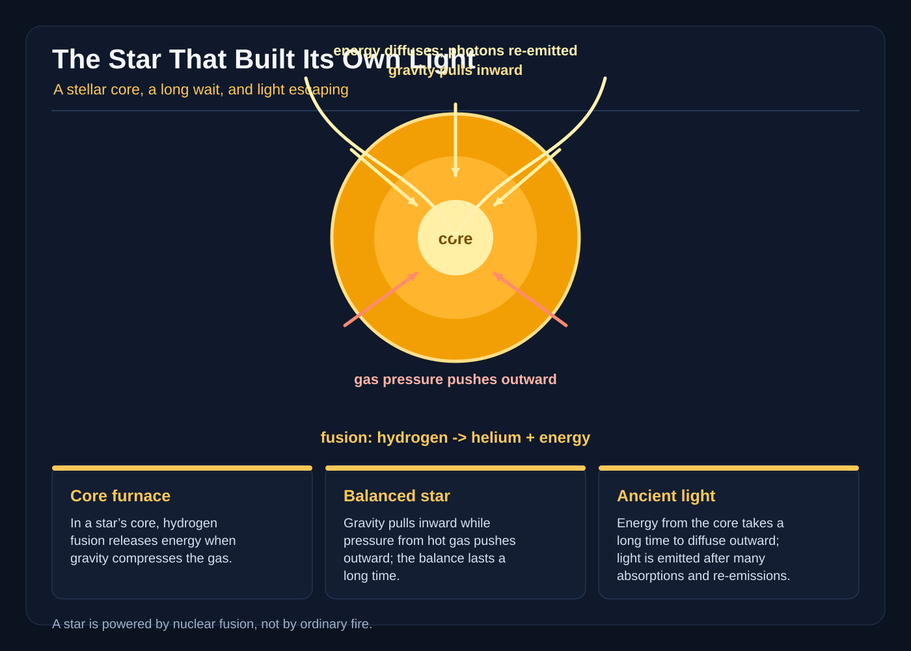

# The Star That Built Its Own Light

On the last night of summer, Neri Vale saw a lighthouse in the sky.

It hung above the western cliffs, a white star with a beam turning slowly around it. The beam did not sweep out to sea. It swung downward, crossed the black water, and touched a silver patch near the shore. When it returned, the patch was gone. The star kept turning, patiently, as if searching for a ship.

Neri was supposed to be polishing the brass rail outside Orison Light, the old lighthouse at the end of the cliff. She stopped with the cloth in her hand. The real lighthouse had been dark for twenty years, but its glass lens remained in the tower, thick as a frozen window. Her aunt Mara, the astronomer who lived in the keeper’s cottage, came outside and looked up.

“That is not a star,” Mara said.

“It has a beam.”

“Stars do not carry lighthouse lenses.”

“Then what is it?”

Mara’s eyes narrowed. She was already counting, the way she did whenever a puzzle frightened her. “Bring the sky book. If something is shining, we write down what it is doing before we decide what it means.”

The book was green, with a brass clasp and pages soft as cloth. Neri opened it to the newest date. Mara had drawn a small circle for every clear night and written the wind, the tide, and the phase of the moon. On the previous page, beside a note about a family of gulls, Mara had written: *No tower, no light, no excuse.*

Neri looked again. The beam passed over the water and found a ribbon of fog. For one heartbeat the whole cliff shone silver. In that heartbeat she felt less like a girl on a dark shore than a speck held between two enormous distances.

“I’m going to find it,” she said.

“Find the star?”

“Find whatever is shining it.”

Mara took the sky book from her. “Then take the field lens. And if the impossible lighthouse asks you to make a bargain, remember that lighthouses have poor negotiating skills. They only know how to point.”

The path to the old signal station ran along the cliff, where the wind worried at Neri’s coat and the sea worried at the rocks below. The station was a squat stone building with a round roof and three tall windows. Its door had been locked since Neri was six. Mara kept the key in a box beneath a false floorboard, beside a collection of bottle stoppers and a tin of buttons from ships that never came home.

Inside, the station smelled of salt, dust, and warm metal. A giant mirror leaned against the back wall. It was taller than Neri and silvered on one side. In front of it stood a framework of lenses, prisms, and little brass doors. The central lens was empty. A crank ran from the roof to a platform above the windows.

Mara lit a lamp. “This station was built to receive starlight. The original keepers called it the Listening Tower. They believed the sky might send messages.”

Neri looked at the mirror. “Why is the lens missing?”

“Because people stopped believing in messages. They thought a lamp had to be lit to be useful.”

The roof turned with a slow wooden groan. Sunlight from the hidden sun slipped through the windows and touched the framework. Neri pulled the crank. The roof rotated, and the upper lens caught a wedge of brightness. It threw a rainbow across the floor, then narrowed into a bar of white. The bar swept over Mara, over the door, and out toward the western sea.

Neri’s impossible lighthouse was a machine.

She ran to the other side of the station and turned the crank faster. The beam moved around the walls, bouncing from prism to mirror. When she aimed it through a crack in the shutters, the bar of light climbed into the sky and met the white star hanging there. For a moment the two beams seemed to join.

“That star is ninety-three light-years away,” Mara said, reading Neri’s question in her face. “Or near enough. Its light is ninety-three years old by the time it touches us.”

Neri frowned. “Then why does it look as if it is starting now?”

“Because arrival is not beginning. A letter can reach your hand long after the hand that wrote it has gone to sleep.”

Mara opened a drawer and took out a spectroscope, a narrow brass tube with a glass prism at one end. She aimed it at the star. The white point spread into a tiny striped band: red and orange, blue and violet, interrupted by dark lines. Neri had seen those lines in school, but never in a sky that seemed close enough to touch.

“Those dark lines are fingerprints,” Mara said. “They tell us what gases are between us and the star. The pattern says the light passed through a hot atmosphere. It is starlight, not a will-o’-the-wisp.”

Neri reached for the mirror. “Then we can answer it.”

“You can’t answer a star ninety-three years away. Not tonight.”

A soft chime came from the upper platform. The beam had reached a silver stairway in the clouds, a staircase made from rain and moonlight. It did not descend from the star. It descended from the tower’s prism, crossing the dark air and ending on the station floor. At its foot stood a small door that had not been there before.

Neri looked at Mara. Mara’s face had gone pale, but she handed Neri the field lens.

“Go,” she said. “If it is a vision, look for a question. If it is a place, do not step away from the light.”

Neri climbed. The first step was warm. The second was cold. By the third, the station had vanished, the cliffs had vanished, and Mara’s hand was no longer on her shoulder. Neri stood inside a warm, bright cavern without walls. Beneath her feet, immense ropes of golden light pulled down. Above her, blue-white gas pressed outward. Between them, shelves of glowing matter floated in uneasy balance.

A small figure in a silver coat climbed out of a hatch. He had a face made of shifting sparks and a crown shaped like a wide bowl.

“You have arrived at the wrong part of a star,” he said.

Neri gripped the field lens. “I came from a lighthouse.”

“Most visitors say that.”

“What is this place?”

“The inside of a star. Or the idea of one. The tower prism can show what a child’s mind can carry.”

The figure pointed down. “Gravity is the downward pull of all the star’s mass. It gathers the gas inward. Pressure pushes outward from the hot, crowded gas. In a star, these two forces balance. Not perfectly, and not forever, but for an astonishingly long time.”

Neri watched the golden ropes tug at the shelves. “If gravity wins, doesn’t the star collapse?”

“Then the core gets denser and hotter. If the outward push grows too strong, the star expands and cools. A star is not a frozen statue. It keeps adjusting, breathing in scales too slow for a human lifetime.”

Neri looked toward the center. “What makes the heat?”

The figure led her down through layers of red and gold. Here the gas was so crowded that light itself seemed to bump along. They passed shelves where atoms moved in loose schools. Deeper down, the hydrogen was packed so tightly that its electrons could not settle into comfortable arrangements. Neri felt a pressure in her imaginary bones, though she knew the pressure belonged to the star, not to her.

At the center, four blue lights drifted in a ring.

The figure caught them in a transparent cup. “This is hydrogen. In the core, the temperature and pressure are enormous. Hydrogen nuclei can join, through a long chain of steps, and four of them can become one helium nucleus.”

The blue lights circled. One flashed and changed. Another vanished into the glow. A third struck the ring and left behind a smaller, brighter cluster. At last, a pale gold sphere trembled in the cup.

“There,” the figure said. “Not a fire. Hydrogen has become helium, and the mass that is no longer in the core is released as energy.”

Neri leaned closer. “The star is burning.”

“No burning. Burning is a chemical reaction that uses fuel and usually needs oxygen. The core is a hot plasma, mostly hydrogen. Its energy comes from fusion, the joining of light nuclei. Each joining is tiny. The star contains so much hydrogen that enormous numbers of these events happen all the time.”

The figure looked at her sternly. “And they do not all happen at once. A single fusion event would not make a star shine. The total change is slow compared with a human heartbeat. A star lasts millions or billions of years because it has an immense supply and a carefully balanced rate.”

Neri’s gaze moved past him. Beyond the core, a river of light climbed through the star. It traveled only a short distance, then vanished. Farther on, another patch of light appeared and changed direction. Again and again, the light was caught and sent elsewhere.

“The light is not taking a straight road,” she said.

“No. In the dense interior, photons are constantly absorbed and re-emitted. Each event can send the energy in a different direction. The path is a random walk: a short step this way, a short step that way, with no single clean route outward.”

The figure opened a door marked with a huge number. Behind it lay a maze of mirrors, each mirror facing a different direction. A glowing traveler entered. It ricocheted left, right, backward, forward, and at last found a gap. The journey looked impossibly long.

“If one light quantum could march straight through, it would cross the star quickly,” the figure said. “But repeated scattering can make the energy’s journey take tens of thousands or even hundreds of thousands of years in a star like the Sun. Different stars take different times. This is a useful estimate, not a stopwatch, and no single photon can be followed all the way after every absorption.”

Neri thought of the lighthouse. “So the beam outside is built by millions of tiny detours?”

“Millions, perhaps far more. The energy keeps changing carriers and directions. It diffuses outward until the gas becomes transparent enough for light to escape. The surface is not a hard floor. It is a glowing layer called the photosphere. From there, it can travel through space in a straight line.”

The maze dissolved. Neri stood on a white platform at the center of a vast furnace. Above her, the light climbed through layers of orange and gold. The star’s pressure pushed from below. Its gravity pulled from above. Between them, hydrogen was becoming helium, and the lost mass was becoming heat and radiation.

The star was not exploding. It was building its own light, one tiny rearrangement after another.

Neri opened her eyes in the Listening Tower. The sky beyond the windows had not changed. The star was still there, the lighthouse beam still turned above the cliffs. But a new sound came from the harbor: a bell, ringing without pause.

Mara was at the door. “A fishing boat called the Wren has missed its return. The fog is thick, and the old channel markers are gone.”

Neri looked at the great mirror. “The star can light the water.”

“It is ninety-three years old light.”

“I know. It is old, but it is here now. It can shine on something that is here now.”

Mara’s eyes widened. Neri ran to the crank. The tower roof turned. The star entered the empty lens, the mirror gathered its light, and the beam swept across the black bay. Instead of pointing into the sky, Neri aimed it low, over the dangerous reef. The prism split the light into a broad silver fan. It touched the water, the rocks, and the fog. For a heartbeat, the whole coast was visible.

From the dark came a lantern. One blink. Two. Three.

The Wren had seen them.

Mara grabbed the shutter handle. “We can signal with the old star. Three flashes means safe water. One means turn back.”

Neri’s hands shook. The star’s light had left before Neri was born, perhaps before anyone in her family had stood on this coast. It carried a message from a past that could not know this fog, this reef, or this boat. Yet the light had crossed the distance, fallen on the present sea, and made a path that a living sailor could see.

She counted the rhythm of the harbor bell. Then she opened and closed the shutter. Three times, each flash timed to the bell. The Wren answered with three bright points, then turned its lantern toward the channel. Neri saw the little boat slip between two black teeth of rock. The safe passage was narrow. One wrong turn would have sent the hull against stone.

When the boat reached the harbor, the fog lifted enough to reveal its mast. The crew cheered, but Neri did not. She watched the impossible lighthouse above the sea. Its beam was still turning, still perfect, still showing no sign of the danger below.

In her green sky book, she wrote the date, the place, and the distance. Then she added: *The star’s light is old. The light we see left before our present. A message can be old and still be useful, but we must not mistake it for news about now.*

Underneath, she drew a small star, four hydrogen lights, and a crooked road of arrows leaving the core.

Mara read the note. “A field report?”

Neri closed the book. “A promise. Tomorrow I will calculate the beam’s travel time. Tonight the harbor is safe.”

At sunrise, the star vanished into blue sky. The lighthouse beam disappeared with it. On the water, the Wren’s wake shone for a moment, then vanished too. Neri stood in the tower doorway, holding the book to her chest. Somewhere, a star was still making light in its enormous core. It would keep doing so long after the fog, the boat, and the promise were gone. The light was taking its own time. Now Neri knew she must do the same.
