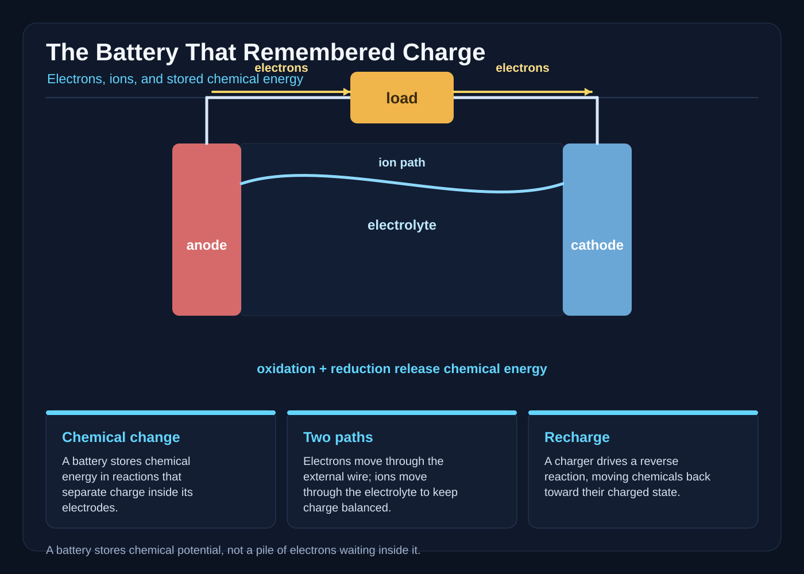

# The Battery That Remembered Charge

The lighthouse had a heartbeat, but on the night of the black storm its heartbeat skipped.

Tamsin heard it first. She was thirteen, with salt-stiff hair and a yellow raincoat two sizes too large, and she was counting the turns of the old brass winch when the ticking stopped.

The lighthouse stood on Mallow Reef, a black tooth of rock three miles from the mainland. Above Tamsin, the lens turned inside its glass cage, dragging a pale blade of light across the rain. Below, the stairwell shook whenever the sea struck the reef.

“Tamsin!” called Neri from the battery room. “The lamp is brown.”

Brown was lighthouse code for a light that had power but not enough of it. The beam should have been white enough to burn a hole in the storm. Instead, it arrived soft and yellow, as if the sea had put a thumb over it.

Neri was fifteen and wore a keeper’s vest with every pocket sewn shut. He came up the stairs with a meter in one hand and a flashlight in the other. His hair stood up where the battery room’s damp air had dried it.

“The shore power failed,” he said. “The battery is taking over.”

“Take over?” Tamsin followed him down.

The battery room was below the rock’s waist, where the walls sweated even on fair days. Six squat black boxes stood on a steel rack. They were connected by copper links, each link a flat, bright tongue between terminals. A red charge light blinked above them.

The boxes were sealed rechargeable batteries. Their cases were stamped MORROW 12, a name the old keeper had given the bank because it was supposed to keep the light shining after dark.

“The meter says twelve point six volts,” Neri said. “That’s full.”

“The light says otherwise.”

Neri touched a clip to a terminal. The meter made a soft chirp, then the number sank.

He stared at it. “A full battery can still be weak.”

The keeper, Mara Venn, came down with her hood streaming. She was the only person on the reef who knew every bolt in the place. “What did you find?”

“Nothing yet,” Neri said. “That is different from finding nothing.”

At midnight, the brown light became a blink.

The first blink lasted half a second. Then another, then another. Each time, the lens room went nearly black. Tamsin imagined the sea creatures below seeing a lighthouse that had forgotten how to speak.

Neri placed a clamp meter around the cable feeding the lamp. Its needle rose to four amps, fell to zero, and rose again.

“That is the mystery,” he said. “The lamp is asking for current, but the battery is losing it before the light gets there.”

“Could the battery remember the old current?” Tamsin asked. “The name says—”

“Morrow is a name, not a law.” Mara handed Neri a wrench. “A battery does not sit there holding a box of spare electrons.”

Neri frowned. “Then what is inside?”

“Chemistry with a very good safety rule.”

Mara pointed to the rack. “Find the unwanted path.”

The room smelled of rain, salt, and hot dust. Neri checked the lamp circuit first. He opened the breaker and watched the meter fall to zero. He closed it, and the needle jumped. The load was drawing current, but the battery voltage dipped whenever the lamp tried to use it.

A battery can show a healthy voltage and still collapse under load. A meter with no circuit attached measures the voltage between terminals. Turn on a lamp, and the current asks the electrodes to supply energy faster. If one connection is damaged, a cell is weak, or a hidden short is draining the pack, the reading can change.

Neri opened the inspection panel beside the rack. Beneath it, a neat bundle of wires ran to the shore-power switch, the emergency lamp, and a row of small relays. Salt crystals glittered on the floor.

He traced the wires with a pencil, not touching the metal.

“Here,” he said.

A thin green line of corrosion ran from the positive cable gland to the steel rack. The gland had cracked during the storm. Seawater had wicked into the crack and formed a damp film. The film was not supposed to touch two different potentials. Now it did.

Mara crouched beside him. “That is a leak path.”

“A short?” Tamsin asked.

“Not a dead short. A slow thief.” Neri touched the meter probe to the film, then to the rack. The needle moved. “A little current is taking the wrong route.”

He drew the shape in his field notebook. A rectangle represented the battery. Inside it, he drew two vertical lines for electrodes and a wavy band between them for electrolyte. A line left one electrode, passed through a lamp symbol, and returned to the other electrode. An arrow followed the outside wire from the negative terminal toward the lamp. Inside, he drew small plus and minus signs drifting in different directions.

“During discharge,” he said, tapping the outside line, “oxidation happens at the negative electrode. Oxidation means a substance loses electrons. Those electrons leave through the external circuit. The lamp uses their energy. At the positive electrode, reduction happens: a substance gains electrons.”

He drew a second arrow beside the first, pointing the other way, and labeled it conventional current.

“The electrons travel through the wire from negative to positive. The current arrow used in circuits points the opposite way because it follows the direction a positive charge would move. The names are important so we do not draw the circuit backwards.”

“What about the middle?” Tamsin pointed at the wavy band. “Do the electrons go through there?”

“Not normally. The electrolyte carries ions, not a stream of electrons from one side to the other. The separator inside the battery lets ions move while keeping the electrodes apart. Ions move because reactions at the electrodes change the charge balance. Cations and anions travel in ways that compensate for what is being created or consumed. The exact directions depend on the battery chemistry.”

Neri drew a little bridge across the electrolyte and labeled it ion movement.

“So the path is not empty,” Tamsin said.

“No. The circuit is a team. The wire and the load handle electrons; the electrolyte handles ions. Both paths are necessary.”

Mara pointed to the corroded film. “And this is what happens when the team gets a shortcut.”

The room lights dimmed. The emergency lamp, which should have burned steadily while the main lamp was out, flickered again.

Neri looked toward the rack. “If we keep running this, the battery may be damaged before the storm does.”

“Then show me the shortcut,” Mara said.

Neri used a spare training cell, a small bulb, a switch, and two alligator clips. It was a demonstration cell, not one of the lighthouse batteries, and its transparent sides showed a pale gel between two graphite plates. He set it on a dry mat.

“Never open a sealed battery in here,” he said. “The gel in this trainer is harmless enough for the demonstration kit, and the real cells stay closed.”

He drew the same diagram beside the trainer, then connected the bulb between the marked terminals. The bulb glowed. When he opened the switch, it went dark. When he closed it again, it glowed.

Neri touched the voltmeter across the bulb. “The energy began as chemical potential in the cell. The reactions separated charge. That charge difference drove electrons through this wire. The bulb changed electrical energy into light and heat. The cell’s chemicals changed as the energy left.”

He pointed to the trainer’s electrodes. “In this cell, oxidation releases electrons at the negative plate. Reduction accepts them at the positive plate. The cell does not manufacture electrons. The reactions make electrons available on one side and consume them on the other.”

Tamsin watched the bulb. “So the electrons were waiting inside?”

“Not as a stored pile.” Neri tapped the sealed case of the real battery. “The useful energy is in the tendency of the electrode materials to react: their chemical potential. When the circuit is open, the reactions are not driving a current through a wire. When the circuit closes, the reactions can proceed, and electrons appear at one electrode and are taken at the other. The cell stores the arrangement and chemical tendency, not a warehouse of loose electrons.”

Mara nodded. “That is why a battery can sit on a shelf and still have energy. It is not because electricity is hiding in a tank. It is because the ingredients are ready to make a controlled reaction.”

Neri switched off the demonstration bulb and checked the lighthouse meter again. The load current still jumped whenever the lamp tried to brighten. The battery voltage sagged with every jump.

“The corrosion is draining power,” Tamsin said.

“Possibly,” Neri replied. “But we need to know whether the pack is also weak. If the cells are damaged, cleaning the film buys us a few minutes, not a whole night.”

Mara opened the maintenance cabinet and took out a portable load tester. “Use the smaller lamp first. Then, if the cells hold, use the real lamp. We prove the path before we risk the beacon.”

The storm shook the lighthouse. Water slashed across the high windows. Tamsin followed Neri as he cleaned and dried the outside of the rack, removing the salt film and replacing the split gland with a temporary sealed sleeve. He kept his hands away from the battery cases and did not try to scrape inside them.

The green corrosion vanished, but the meter still dipped.

Neri connected the small test lamp. Its glow held for five breaths, dimmed, and came back.

“The shortcut is gone, but the pack is tired,” he said.

Mara checked the cell readings one at a time with the bank disconnected. Most were steady. One reading fell farther than the others under the small load.

“There,” she said. “One cell is the weak link.”

Neri stared at the row of black boxes. “Can we use a cell from the emergency lantern?”

Mara’s face tightened. “Not for long, and not by paralleling it with a different battery. Its chemistry and voltage are not a match. The weak cell has high internal resistance. We isolate it before we charge the bank, then replace it or service it individually.”

The shore connection was dead. The storm had taken the cable ashore. The battery bank was their only source for the lighthouse.

Neri looked at the charger socket. It was a sealed socket beside the rack, meant for the service boat’s power. A red-and-black cable hung nearby, but its plug had been adapted years ago. The adapter’s labels were worn away.

“Could we charge from the lantern cell?” Tamsin asked. “It is electricity, so—”

“Electricity is not a single substance that fits every machine.” Mara crouched beside the charger. “Voltage, current, and chemistry must match. The wrong charger can heat a battery or damage it.”

Neri pulled the field notebook closer and drew a second diagram. This time he drew a charger on one side and the battery on the other. He labeled the charger’s positive and negative outputs. Then he drew arrows for electrons in the external wires. He drew ions moving through the electrolyte in the opposite chemical arrangement, and wrote “reverse reactions” beside the electrodes.

“To recharge,” he said, “the charger must push electrons in the direction that encourages oxidation at one electrode and reduction at the other. The reactions run backward. That changes the electrode materials and restores chemical potential.”

“Can we reverse the reactions just by swapping the wires?” Tamsin asked.

“Not safely. The charger has to be the right voltage and current, and the polarity has to be checked. A wrong connection does not politely reverse a battery. It can make it hot, leak, or fail.”

Mara took the adapter and turned it over. Under the grime, a tiny stamped plus sign appeared.

“This is the correct polarity,” she said. “But we need to prove the charger’s voltage before we connect it.”

They used the service multimeter. The charger’s output held at a safe, controlled level. Mara compared it with the bank’s required charging specification. The numbers matched. She checked the cable insulation, the connector, and the emergency cutoff. The charger also had monitoring and balancing leads for the individual cells, so it could watch for a cell that was charging faster or slower than the others.

Mara opened the matched spare-cell case. “The weak cell comes out first. We do not ask the charger to force current through a high-resistance cell. That could make it hot while the rest of the bank charges normally.”

With the bank disconnected, she removed the copper links around the weak cell and lifted it into a labeled tray. Neri fitted a replacement with the same type and rating. The old cell sat apart from the working bank, its failure preserved as evidence rather than hidden inside a charger’s hum.

“Now we check the cells under load,” Mara said.

Neri connected the small test lamp to each cell in turn, using the service leads and recording voltage, current, and temperature. The old cell’s voltage folded downward. The replacement held steady. Each remaining cell also held within its safe range under the same load. Only then did Mara close the bank’s isolating link.

The decision rested on the notebook diagram. Charge the bank with the weak cell removed, and the lighthouse would have steady power for the night. Charge the weak cell with the bank, and a damaged cell could overheat. Use the emergency lantern cell in a makeshift circuit, and they might dim the light further—or damage equipment.

Neri placed his finger on the disconnect switch. “If we charge now, the cells will draw current even though the lamp is dark.”

“That is expected,” Mara said. “A charger supplies energy to drive the reverse reactions. The pack will not be full the instant we connect it, and the voltage alone is not a promise. We watch current, temperature, and voltage, and the balancing leads help keep the cells on track.”

She looked at Tamsin. “Your mystery was a battery that remembered charge. The real answer is that a circuit can be completed in more than one way, and a number can lie when it is measured without a load.”

Neri closed the charger switch.

A soft hum began. The meter showed current moving into the bank. The indicator light changed from red to amber. For a moment, the chemistry seemed hidden again; then the bank voltage rose, slowly and evenly. The charger’s monitor showed every cell taking charge, with the replacement behaving like its neighbors.

They waited. The storm continued, but the lamp stayed dark while the bank charged. The current settled into a steadier pattern. They tested the bank under the small load again, watching the reading for every cell. None sagged. Only after that verification did Mara connect the bank to the lighthouse through the correct isolator. The emergency lamp blazed white. The lens began to cut a clean path through the rain.

Neri watched the meter, then placed the small test lamp across the bank’s terminals. The test bulb shone steadily for a full minute. He switched it off and on again. Still steady.

“The open-circuit reading is not the whole story,” Tamsin said. “The load tells the truth.”

“Only part of the truth,” Neri said. “A load test shows how the battery behaves while it is being used. A charger can still stop early, and a healthy reading does not promise unlimited energy. We measure before trusting.”

Mara wrote the final note in the field book: storm water, corrosion, weak cell, correct charger.

Then she drew one last arrow around the outside circuit. Negative terminal to lamp to positive terminal. Electrons moving through the wire. Ions moving through the electrolyte to balance the reactions. Chemical potential becoming electrical energy, then light and heat.

“Does the battery remember charge?” Tamsin asked.

Mara looked at the bright lighthouse turning above them. “It remembers because its materials still have a useful chemical arrangement. The light is not a memory stored as electrons. It is energy released now, because the circuit gives the reactions a path.”

Above them, the beam swept across the reef. A fishing boat, far beyond the breaking waves, turned toward the light. Neri’s small test bulb glowed beside the notebook diagram, bright and steady.

Tamsin watched the electrons’ arrow, then the ions’ bridge, and finally the circle of the lighthouse beam.

“Morrow keeps the light,” she said.

Mara smiled. “Morrow keeps the possibility of light. The circuit does the remembering.”
